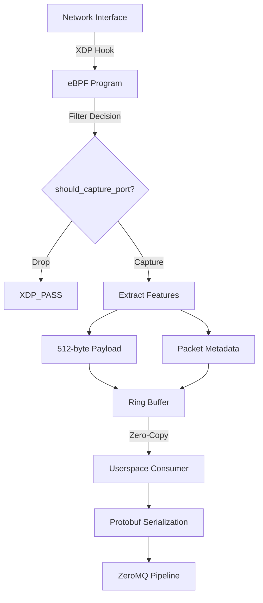
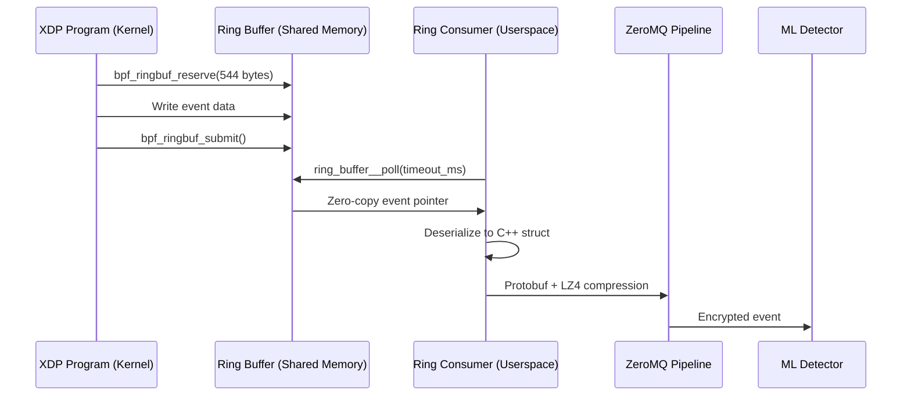

## eBPF Architecture Overview

ML Defender's sniffer uses **eBPF (Extended Berkeley Packet Filter)** with **XDP (eXpress Data Path)** for high-performance packet capture at the kernel level.



### Why eBPF/XDP?

<CardGroup cols={3}>
  <Card title="Performance" icon="gauge-high">
    **&lt;1 μs** packet processing latency
  </Card>
  <Card title="Efficiency" icon="bolt">
    **Zero-copy** kernel → userspace transfer
  </Card>
  <Card title="Safety" icon="shield">
    **Verified** by kernel before loading
  </Card>
</CardGroup>

---

## eBPF Program Structure

### Source File

**Location**: `sniffer/src/kernel/sniffer.bpf.c`

**From source/sniffer/src/kernel/sniffer.bpf.c:1-105:**

```c
// Enhanced eBPF sniffer v3.3 - Hybrid filtering + Dual-NIC deployment
// Supports both blacklist (excluded_ports) and whitelist (included_ports)

// Event structure (544 bytes total)
struct simple_event {
    __u32 src_ip;
    __u32 dst_ip;
    __u16 src_port;
    __u16 dst_port;
    __u8 protocol;
    __u8 tcp_flags;
    __u32 packet_len;
    __u16 ip_header_len;
    __u16 l4_header_len;
    __u64 timestamp;
    __u16 payload_len;
    __u8 payload[512];  // 🔥 512-byte payload capture

    // Dual-NIC deployment metadata
    __u8 interface_mode;     // 0=disabled, 1=host-based, 2=gateway
    __u8 is_wan_facing;      // 1=WAN, 0=LAN
    __u32 source_ifindex;    // Network interface index
    char source_interface[16]; // Interface name
} __attribute__((packed));
```

### BPF Maps

**From source/sniffer/src/kernel/sniffer.bpf.c:114-149:**

```c
// MAP 1: Excluded ports (blacklist)
struct {
    __uint(type, BPF_MAP_TYPE_HASH);
    __uint(max_entries, 1024);
    __type(key, __u16);    // Port number
    __type(value, __u8);   // 1 = excluded
} excluded_ports SEC(".maps");

// MAP 2: Included ports (whitelist - HIGH PRIORITY)
struct {
    __uint(type, BPF_MAP_TYPE_HASH);
    __uint(max_entries, 1024);
    __type(key, __u16);    // Port number
    __type(value, __u8);   // 1 = included
} included_ports SEC(".maps");

// MAP 3: Ring buffer for events (1 MB)
struct {
    __uint(type, BPF_MAP_TYPE_RINGBUF);
    __uint(max_entries, 1 << 20);  // 1 MB buffer
} events SEC(".maps");

// MAP 4: Interface configurations (Dual-NIC support)
struct {
    __uint(type, BPF_MAP_TYPE_HASH);
    __uint(max_entries, 16);              // Up to 16 NICs
    __type(key, __u32);                   // ifindex
    __type(value, struct interface_config);
} iface_configs SEC(".maps");
```

---

## XDP Packet Processing

### Main XDP Hook

**From source/sniffer/src/kernel/sniffer.bpf.c:193-300:**

```c
SEC("xdp")
int xdp_sniffer_enhanced(struct xdp_md *ctx) {
    void *data = (void *)(long)ctx->data;
    void *data_end = (void *)(long)ctx->data_end;

    // STEP 1: Dual-NIC deployment check
    __u32 ifindex = ctx->ingress_ifindex;
    struct interface_config *iface_config = bpf_map_lookup_elem(&iface_configs, &ifindex);
    if (!iface_config || iface_config->mode == INTERFACE_MODE_DISABLED) {
        return XDP_PASS;  // Skip disabled interfaces
    }

    // STEP 2: Verify Ethernet header
    if (data + ETH_HLEN > data_end)
        return XDP_PASS;

    void *ip_start = data + ETH_HLEN;

    // STEP 3: Verify IPv4 header
    if (ip_start + 20 > data_end)
        return XDP_PASS;
    __u8 *ip = (__u8*)ip_start;
    if ((ip[0] >> 4) != 4)  // Check IP version
        return XDP_PASS;

    // STEP 4: Reserve ring buffer space
    struct simple_event *event = bpf_ringbuf_reserve(&events, sizeof(*event), 0);
    if (!event) {
        return XDP_PASS;  // Buffer full, drop event
    }

    __builtin_memset(event, 0, sizeof(*event));

    // STEP 5: Extract packet metadata
    event->src_ip = (ip[12] << 24) | (ip[13] << 16) | (ip[14] << 8) | ip[15];
    event->dst_ip = (ip[16] << 24) | (ip[17] << 16) | (ip[18] << 8) | ip[19];
    event->protocol = ip[9];
    event->packet_len = data_end - data;
    event->timestamp = bpf_ktime_get_ns();

    // STEP 6: Layer 4 processing (TCP/UDP)
    // ... (port extraction, TCP flags, payload capture)

    // STEP 7: Submit event to ring buffer
    bpf_ringbuf_submit(event, 0);

    return XDP_PASS;  // Always pass packet to network stack
}
```

### Filter Logic

**From source/sniffer/src/kernel/sniffer.bpf.c:153-174:**

```c
static __always_inline int should_capture_port(__u16 port) {
    // PRIORITY 1: Whitelist (always capture)
    __u8 *included = bpf_map_lookup_elem(&included_ports, &port);
    if (included && *included == 1) {
        return ACTION_CAPTURE;  // ✅ Whitelist wins
    }

    // PRIORITY 2: Blacklist (drop)
    __u8 *excluded = bpf_map_lookup_elem(&excluded_ports, &port);
    if (excluded && *excluded == 1) {
        return ACTION_DROP;  // ❌ Drop
    }

    // PRIORITY 3: Default action from config
    __u32 key = 0;
    struct filter_config *config = bpf_map_lookup_elem(&filter_settings, &key);
    if (config) {
        return config->default_action;
    }

    return ACTION_CAPTURE;  // Fallback
}
```

---

## 512-Byte Payload Capture

### Why 512 Bytes?

**From source/TESTING.md:382-405:**

1. **PE Executable Detection**: MZ header + DOS stub fits in first 128 bytes
2. **Ransomware Patterns**: Ransom notes, .onion URLs, bitcoin addresses typically in first 512 bytes
3. **Crypto API Calls**: `CryptEncrypt`, `CryptDecrypt` strings detectable
4. **Performance**: 512 bytes = optimal balance (ring buffer size vs. analysis depth)

### Payload Extraction

**From source/sniffer/src/kernel/sniffer.bpf.c:250-280:**

```c
// Calculate payload start
void *payload_start = l4_start + event->l4_header_len;

// Verify payload bounds
if (payload_start > data_end) {
    event->payload_len = 0;
} else {
    // Calculate available payload
    __u32 available = data_end - payload_start;
    event->payload_len = available > 512 ? 512 : available;

    // Copy payload (eBPF verifier-safe loop)
    #pragma unroll
    for (int i = 0; i < 512; i++) {
        if (i >= event->payload_len)
            break;
        if (payload_start + i + 1 > data_end)
            break;
        event->payload[i] = *((uint8_t*)(payload_start + i));
    }
}
```

<Note>
The `#pragma unroll` directive is **critical** for eBPF verifier approval. It ensures the loop is unrolled at compile time, allowing the verifier to prove bounded memory access.
</Note>

---

## Ring Buffer Communication

### Ring Buffer Architecture



### Userspace Consumer

**Location**: `sniffer/src/userspace/ring_consumer.cpp`

```cpp
// Ring buffer callback
static int handle_event(void *ctx, void *data, size_t data_sz) {
    if (data_sz != sizeof(simple_event)) {
        fprintf(stderr, "Invalid event size: %zu\n", data_sz);
        return 0;
    }

    simple_event *event = static_cast<simple_event*>(data);

    // Process event (convert to Protobuf, analyze payload, etc.)
    process_simple_event(event);

    return 0;  // 0 = continue polling
}

// Main consumer loop
void ring_consumer_thread() {
    struct ring_buffer *rb = ring_buffer__new(
        bpf_map__fd(obj->maps.events),
        handle_event,
        nullptr,  // context
        nullptr   // opts
    );

    while (running) {
        int err = ring_buffer__poll(rb, 100 /* timeout_ms */);
        if (err < 0 && err != -EINTR) {
            fprintf(stderr, "Ring buffer poll error: %d\n", err);
            break;
        }
    }

    ring_buffer__free(rb);
}
```

### Zero-Copy Benefits

<CardGroup cols={2}>
  <Card title="Performance" icon="bolt">
    **No memcpy()** from kernel to userspace
  </Card>
  <Card title="Latency" icon="stopwatch">
    **&lt;1 μs** kernel → userspace transfer
  </Card>
  <Card title="CPU Efficiency" icon="microchip">
    **Minimal CPU** for data transfer
  </Card>
  <Card title="Memory" icon="memory">
    **Shared memory** between kernel/userspace
  </Card>
</CardGroup>

---

## Performance Characteristics

### Benchmark Results

**From source/TESTING.md:272-296:**

| Component | Latency | Notes |
|-----------|---------|-------|
| **eBPF capture** | &lt;1 μs | Kernel space, XDP hook |
| **Ring buffer** | &lt;1 μs | Zero-copy delivery |
| **Userspace poll** | ~10 μs | `ring_buffer__poll()` overhead |
| **Total (capture → userspace)** | **~12 μs** | End-to-end |

### Throughput Capacity

**From source/TESTING.md:275-280:**

- **Peak sustained**: 82.35 events/second (17-hour test)
- **Stress burst**: 120 events/second
- **Theoretical max**: 1M+ packets/second (limited by network, not eBPF)

### Memory Footprint

```
Ring Buffer:        1 MB (configurable)
eBPF Program:       ~8 KB (loaded in kernel)
BPF Maps:           ~64 KB (hash tables)
Userspace Consumer: ~4.5 MB RSS (stable over 17h)

Total:              ~5.5 MB
```

---

## Dual-NIC Deployment

### Interface Modes

**From source/sniffer/src/kernel/sniffer.bpf.c:52-74:**

```c
// Interface deployment modes
#define INTERFACE_MODE_DISABLED    0
#define INTERFACE_MODE_HOST_BASED  1  // Capture only traffic destined to host
#define INTERFACE_MODE_GATEWAY     2  // Capture ALL transit traffic (inline)

struct interface_config {
    __u32 ifindex;           // Network interface index
    __u8 mode;               // 0=disabled, 1=host-based, 2=gateway
    __u8 is_wan;             // 1=WAN-facing (internet), 0=LAN-facing (DMZ)
    __u8 reserved[2];        // Alignment padding
};
```

### Configuration Example

```json sniffer.json
{
  "interfaces": [
    {
      "name": "eth0",
      "mode": "host_based",
      "is_wan": true,
      "description": "WAN-facing interface (internet)"
    },
    {
      "name": "eth1",
      "mode": "gateway",
      "is_wan": false,
      "description": "LAN-facing interface (DMZ gateway)"
    }
  ]
}
```

---

## Compilation and Loading

### eBPF Compilation

**From source/sniffer/CMakeLists.txt:**

```cmake
# Compile eBPF program to object file
add_custom_command(
    OUTPUT sniffer.bpf.o
    COMMAND clang -g -O2 -target bpf -D__TARGET_ARCH_x86_64 \
            -I/usr/include/x86_64-linux-gnu \
            -c ${CMAKE_CURRENT_SOURCE_DIR}/src/kernel/sniffer.bpf.c \
            -o sniffer.bpf.o
    DEPENDS src/kernel/sniffer.bpf.c
    COMMENT "Compiling eBPF program"
)

# Generate vmlinux.h (BTF type information)
add_custom_command(
    OUTPUT vmlinux.h
    COMMAND bpftool btf dump file /sys/kernel/btf/vmlinux format c > vmlinux.h
    COMMENT "Generating vmlinux.h from kernel BTF"
)
```

### Loading eBPF Program

```cpp sniffer/src/main.cpp
#include <bpf/libbpf.h>
#include <bpf/bpf.h>

// Load eBPF object file
struct bpf_object *obj = bpf_object__open_file("sniffer.bpf.o", nullptr);
if (!obj) {
    fprintf(stderr, "Failed to open BPF object\n");
    return 1;
}

// Load into kernel
if (bpf_object__load(obj)) {
    fprintf(stderr, "Failed to load BPF object\n");
    bpf_object__close(obj);
    return 1;
}

// Attach XDP program to interface
struct bpf_program *prog = bpf_object__find_program_by_name(obj, "xdp_sniffer_enhanced");
int prog_fd = bpf_program__fd(prog);

if (bpf_set_link_xdp_fd(ifindex, prog_fd, XDP_FLAGS_UPDATE_IF_NOEXIST) < 0) {
    fprintf(stderr, "Failed to attach XDP program\n");
    return 1;
}

printf("✅ XDP program attached to interface %d\n", ifindex);
```

---

## Debugging eBPF Programs

### Verify eBPF Object

```bash
# Check BPF object file
file sniffer.bpf.o
# Output: sniffer.bpf.o: ELF 64-bit LSB relocatable, eBPF...

# Dump BPF program
llvm-objdump -S sniffer.bpf.o

# Check maps
llvm-objdump -h sniffer.bpf.o | grep -i maps
```

### Runtime Inspection

```bash
# List loaded BPF programs
sudo bpftool prog show

# List BPF maps
sudo bpftool map show

# Dump map contents
sudo bpftool map dump id <map_id>

# Check XDP attachment
sudo bpftool net show
```

### Trace Events

```bash
# Enable BPF tracing
sudo bpftool prog tracelog

# Add debug prints in eBPF code
bpf_printk("Captured packet: src=%pI4 dst=%pI4\n", &event->src_ip, &event->dst_ip);

# View traces
sudo cat /sys/kernel/debug/tracing/trace_pipe
```

---

## Limitations and Constraints

### eBPF Verifier Constraints

<AccordionGroup>
  <Accordion title="Stack Size Limit: 512 bytes">
    eBPF programs have a limited stack. Use BPF maps for larger data structures.
    
    ```c
    // ❌ WRONG - Stack overflow
    uint8_t buffer[1024];
    
    // ✅ CORRECT - Use per-CPU array map
    struct {
        __uint(type, BPF_MAP_TYPE_PERCPU_ARRAY);
        __uint(max_entries, 1);
        __type(key, __u32);
        __type(value, uint8_t[1024]);
    } temp_buffer SEC(".maps");
    ```
  </Accordion>

  <Accordion title="Instruction Limit: 1M instructions">
    Complex programs may exceed the verifier's instruction limit. Use tail calls to chain programs.
  </Accordion>

  <Accordion title="No Unbounded Loops">
    All loops must be bounded and verifiable.
    
    ```c
    // ❌ WRONG - Unbounded loop
    while (condition) { ... }
    
    // ✅ CORRECT - Bounded loop with #pragma unroll
    #pragma unroll
    for (int i = 0; i < 512; i++) {
        if (i >= payload_len) break;
        payload[i] = data[i];
    }
    ```
  </Accordion>

  <Accordion title="Pointer Arithmetic Restrictions">
    All pointer accesses must be bounds-checked before use.
    
    ```c
    // ✅ Always check bounds
    if (data + offset + sizeof(struct iphdr) > data_end)
        return XDP_PASS;
    
    struct iphdr *iph = (struct iphdr *)(data + offset);
    ```
  </Accordion>
</AccordionGroup>

---

## Next Steps

<CardGroup cols={2}>
  <Card title="ML Training" icon="brain" href="/advanced/ml-training">
    Train models for the 83-feature pipeline
  </Card>
  <Card title="Stress Testing" icon="gauge-high" href="/advanced/stress-testing">
    Validate eBPF performance under load
  </Card>
  <Card title="Performance Tuning" icon="sliders" href="/operations/performance">
    Optimize ring buffer and XDP settings
  </Card>
  <Card title="Troubleshooting" icon="wrench" href="/troubleshooting">
    Debug eBPF loading and runtime issues
  </Card>
</CardGroup>