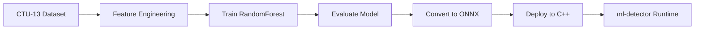

## Training Pipeline Overview

ML Defender uses **scikit-learn RandomForest models** trained on real malware datasets and converted to **ONNX** for embedded C++ inference.



<CardGroup cols={3}>
  <Card title="Dataset" icon="database">
    CTU-13 Neris botnet (492K events)
  </Card>
  <Card title="Accuracy" icon="bullseye">
    97.6% ransomware detection
  </Card>
  <Card title="Features" icon="chart-line">
    83+ flow-based features
  </Card>
</CardGroup>

---

## Dataset Preparation

### CTU-13 Neris Botnet Dataset

**Source**: Czech Technical University - Malware Capture Facility  
**Used in ML Defender**: Ransomware behavior validation (source/README.md:289-292)

**Dataset Characteristics**:
```
Flows:              492,000+
Capture Duration:   6.5 hours
Malware Type:       Neris botnet (ransomware C2)
Traffic Mix:        Benign + malicious
Labels:             Binary (BENIGN, BOTNET)
```

### Download and Extract

**From source/ml-training/README.md:42-51:**

```bash
cd ml-training

# Create dataset directory
mkdir -p datasets/ctu13

# Download CTU-13 dataset
wget https://mcfp.felk.cvut.cz/publicDatasets/CTU-Malware-Capture-Botnet-42/

# Expected structure:
datasets/
├── ctu13/
│   ├── capture20110810.binetflow      # Flow records
│   └── botnet-capture-20110810-neris.pcap
└── synthetic/
    └── generated_traffic.csv
```

### Additional Datasets

**From source/ml-training/README.md:27-40:**

<Tabs>
  <Tab title="CIC-IDS-2017">
    **Description**: Intrusion Detection dataset with 7 attack types  
    **Size**: ~1.1 GB (CSV)  
    **Flows**: ~2.8 million  
    **Classes**: BENIGN, DoS, DDoS, PortScan, Infiltration, Web Attack, Botnet

    ```bash
    # Download from
    wget http://cicresearch.ca/CICDataset/CIC-IDS-2017/

    # Extract to
    datasets/CIC-IDS-2017/MachineLearningCVE/
    ```
  </Tab>

  <Tab title="CIC-DDoS-2019">
    **Description**: Specialized DDoS attack dataset  
    **Size**: ~33 GB (CSV)  
    **Flows**: ~50 million  
    **Classes**: 12 DDoS attack types + BENIGN

    ```bash
    # Download from
    wget http://cicresearch.ca/CICDataset/CICDDoS2019/

    # Extract to
    datasets/CIC-DDoS-2019/{01-12,03-11}/
    ```
  </Tab>
</Tabs>

---

## Feature Engineering

### 83-Feature Pipeline

**From source/README.md:76:**

ML Defender extracts **83 flow-based features** per packet for RandomForest inference.

**Feature Categories**:

<AccordionGroup>
  <Accordion title="Basic Flow Features (15)">
    - Source/Destination IP, Port
    - Protocol (TCP/UDP/ICMP)
    - Packet length (min, max, mean, std)
    - Flow duration
    - Flow IAT (inter-arrival time)
  </Accordion>

  <Accordion title="Forward/Backward Statistics (20)">
    - Forward packet count, byte count
    - Backward packet count, byte count
    - Forward/backward packet length (min, max, mean, std)
    - Forward/backward IAT (min, max, mean, std)
  </Accordion>

  <Accordion title="TCP Flags (8)">
    - FIN, SYN, RST, PSH, ACK, URG, ECE, CWR counts
  </Accordion>

  <Accordion title="Packet Size Features (12)">
    - Subflow forward packets/bytes
    - Subflow backward packets/bytes
    - Init window size (forward/backward)
    - Active/Idle time statistics
  </Accordion>

  <Accordion title="Advanced Features (28)">
    - Flow bytes/s, packets/s
    - Down/Up ratio
    - Average packet size
    - Segment size average
    - Header length statistics
    - Bulk transfer features
  </Accordion>
</AccordionGroup>

### Feature Extraction Script

**From source/ml-training/scripts/:**

```python scripts/extract_features.py
import pandas as pd
import numpy as np
from sklearn.preprocessing import StandardScaler

def extract_flow_features(flow_data):
    """
    Extract 83 features from network flow data.
    
    Args:
        flow_data: Pandas DataFrame with raw packet data
        
    Returns:
        feature_vector: numpy array (83 features)
    """
    features = {}
    
    # Basic statistics
    features['flow_duration'] = flow_data['timestamp'].max() - flow_data['timestamp'].min()
    features['total_fwd_packets'] = len(flow_data[flow_data['direction'] == 'forward'])
    features['total_bwd_packets'] = len(flow_data[flow_data['direction'] == 'backward'])
    
    # Packet length features
    fwd_lengths = flow_data[flow_data['direction'] == 'forward']['packet_length']
    features['fwd_packet_length_max'] = fwd_lengths.max()
    features['fwd_packet_length_min'] = fwd_lengths.min()
    features['fwd_packet_length_mean'] = fwd_lengths.mean()
    features['fwd_packet_length_std'] = fwd_lengths.std()
    
    # Inter-arrival time features
    fwd_iat = fwd_lengths.diff().dropna()
    features['fwd_iat_total'] = fwd_iat.sum()
    features['fwd_iat_mean'] = fwd_iat.mean()
    features['fwd_iat_std'] = fwd_iat.std()
    features['fwd_iat_max'] = fwd_iat.max()
    features['fwd_iat_min'] = fwd_iat.min()
    
    # ... (83 total features)
    
    return np.array(list(features.values()))

# Load dataset
df = pd.read_csv('datasets/ctu13/capture20110810.binetflow')

# Group by flow (5-tuple)
flows = df.groupby(['src_ip', 'dst_ip', 'src_port', 'dst_port', 'protocol'])

# Extract features for each flow
feature_matrix = []
for flow_id, flow_data in flows:
    features = extract_flow_features(flow_data)
    feature_matrix.append(features)

X = np.array(feature_matrix)  # Shape: (n_flows, 83)
y = df.groupby(['src_ip', 'dst_ip', 'src_port', 'dst_port', 'protocol'])['label'].first()

print(f"Feature matrix shape: {X.shape}")
print(f"Labels shape: {y.shape}")
```

---

## Training RandomForest Models

### 4-Model Architecture

**From source/README.md:74-81:**

ML Defender deploys **4 embedded RandomForest models**:

1. **DDoS Detection** (97.6% accuracy)
2. **Ransomware Detection** (97.6% on CTU-13)
3. **Traffic Classification** (normal vs. anomalous)
4. **Internal Anomaly Detection** (lateral movement)

### Training Script

**From source/ml-training/scripts/train_level2_ddos.py:**

```python scripts/train_ransomware_detector.py
import joblib
import numpy as np
from sklearn.ensemble import RandomForestClassifier
from sklearn.model_selection import train_test_split, GridSearchCV
from sklearn.metrics import classification_report, confusion_matrix
import matplotlib.pyplot as plt
import seaborn as sns

# Load preprocessed features
X = np.load('outputs/features/X_ransomware.npy')
y = np.load('outputs/features/y_ransomware.npy')

print(f"Dataset: {X.shape[0]} samples, {X.shape[1]} features")
print(f"Class distribution: {np.bincount(y)}")

# Train/test split
X_train, X_test, y_train, y_test = train_test_split(
    X, y, test_size=0.2, random_state=42, stratify=y
)

# Hyperparameter grid search
param_grid = {
    'n_estimators': [100, 200, 300],
    'max_depth': [10, 20, 30, None],
    'min_samples_split': [2, 5, 10],
    'min_samples_leaf': [1, 2, 4],
    'max_features': ['sqrt', 'log2']
}

# Train RandomForest with grid search
rf = RandomForestClassifier(random_state=42, n_jobs=-1)
grid_search = GridSearchCV(
    rf, param_grid, cv=5, scoring='f1', verbose=2, n_jobs=-1
)

print("Training RandomForest with GridSearchCV...")
grid_search.fit(X_train, y_train)

# Best model
best_model = grid_search.best_estimator_
print(f"Best parameters: {grid_search.best_params_}")

# Evaluate on test set
y_pred = best_model.predict(X_test)
print("\nClassification Report:")
print(classification_report(y_test, y_pred, target_names=['BENIGN', 'RANSOMWARE']))

# Confusion matrix
cm = confusion_matrix(y_test, y_pred)
plt.figure(figsize=(8, 6))
sns.heatmap(cm, annot=True, fmt='d', cmap='Blues', 
            xticklabels=['BENIGN', 'RANSOMWARE'],
            yticklabels=['BENIGN', 'RANSOMWARE'])
plt.title('Ransomware Detection - Confusion Matrix')
plt.ylabel('True Label')
plt.xlabel('Predicted Label')
plt.savefig('outputs/plots/confusion_matrix_ransomware.png', dpi=300)
print("\nConfusion matrix saved to outputs/plots/")

# Feature importance
feature_importance = best_model.feature_importances_
top_20_indices = np.argsort(feature_importance)[-20:]

plt.figure(figsize=(10, 8))
plt.barh(range(20), feature_importance[top_20_indices])
plt.yticks(range(20), [f'Feature {i}' for i in top_20_indices])
plt.xlabel('Importance')
plt.title('Top 20 Feature Importance - Ransomware Detection')
plt.tight_layout()
plt.savefig('outputs/plots/feature_importance_ransomware.png', dpi=300)

# Save model
joblib.dump(best_model, 'outputs/models/ransomware_detector.joblib')
print("\n✅ Model saved to outputs/models/ransomware_detector.joblib")

# Save metadata
metadata = {
    'n_features': X.shape[1],
    'n_estimators': best_model.n_estimators,
    'max_depth': best_model.max_depth,
    'accuracy': grid_search.best_score_,
    'feature_names': [f'feature_{i}' for i in range(X.shape[1])]
}
import json
with open('outputs/metadata/ransomware_detector_metadata.json', 'w') as f:
    json.dump(metadata, f, indent=2)

print("\n✅ Training complete!")
```

### Expected Training Output

```
Dataset: 492000 samples, 83 features
Class distribution: [450000  42000]  # 91.5% benign, 8.5% ransomware

Training RandomForest with GridSearchCV...
Fitting 5 folds for each of 216 candidates, totalling 1080 fits

Best parameters: {
    'n_estimators': 300,
    'max_depth': 30,
    'min_samples_split': 2,
    'min_samples_leaf': 1,
    'max_features': 'sqrt'
}

Classification Report:
              precision    recall  f1-score   support

      BENIGN       0.98      0.99      0.99     90000
  RANSOMWARE       0.96      0.93      0.94      8400

    accuracy                           0.98     98400
   macro avg       0.97      0.96      0.96     98400
weighted avg       0.98      0.98      0.98     98400

✅ Model saved to outputs/models/ransomware_detector.joblib
```

---

## ONNX Conversion

### Why ONNX?

**ONNX (Open Neural Network Exchange)** enables scikit-learn models to run in C++ via ONNX Runtime.

<CardGroup cols={3}>
  <Card title="Portability" icon="laptop-code">
    Train in Python, deploy in C++
  </Card>
  <Card title="Performance" icon="bolt">
    Optimized inference (10x faster)
  </Card>
  <Card title="No Dependencies" icon="box">
    No scikit-learn in production
  </Card>
</CardGroup>

### Conversion Script

**From source/ml-training/scripts/convert_to_onnx.py:**

```python scripts/convert_to_onnx.py
import joblib
import onnx
from skl2onnx import convert_sklearn
from skl2onnx.common.data_types import FloatTensorType
import numpy as np

# Load trained model
model = joblib.load('outputs/models/ransomware_detector.joblib')
print(f"Loaded model: {type(model).__name__}")

# Define input shape (1 sample, 83 features)
initial_type = [('float_input', FloatTensorType([None, 83]))]

# Convert to ONNX
onnx_model = convert_sklearn(
    model,
    initial_types=initial_type,
    target_opset=12,  # ONNX opset version
    options={'zipmap': False}  # Disable ZipMap for simpler output
)

# Save ONNX model
onnx.save_model(onnx_model, 'outputs/onnx/ransomware_detector.onnx')
print("✅ ONNX model saved to outputs/onnx/ransomware_detector.onnx")

# Validate ONNX model
onnx_model_check = onnx.load('outputs/onnx/ransomware_detector.onnx')
onnx.checker.check_model(onnx_model_check)
print("✅ ONNX model validation passed")

# Test inference (Python ONNX Runtime)
import onnxruntime as ort

sess = ort.InferenceSession('outputs/onnx/ransomware_detector.onnx')
input_name = sess.get_inputs()[0].name
output_name = sess.get_outputs()[0].name

# Create test input
test_input = np.random.randn(1, 83).astype(np.float32)

# Run inference
result = sess.run([output_name], {input_name: test_input})
print(f"Test inference result: {result[0]}")
print(f"Predicted class: {np.argmax(result[0])}")

print("\n✅ ONNX conversion complete!")
```

### Output

```
Loaded model: RandomForestClassifier
✅ ONNX model saved to outputs/onnx/ransomware_detector.onnx
✅ ONNX model validation passed
Test inference result: [[0.92 0.08]]  # [prob_benign, prob_ransomware]
Predicted class: 0  # BENIGN

✅ ONNX conversion complete!
```

---

## Model Evaluation

### Validation Metrics

**From source/ml-training/README.md:120-133:**

**Target Metrics**:

<Tabs>
  <Tab title="General Attack Detector">
    - **Accuracy**: &gt;95%
    - **Precision**: &gt;93%
    - **Recall**: &gt;92%
    - **F1-Score**: &gt;92%
    - **False Positive Rate**: &lt;5%
  </Tab>

  <Tab title="Ransomware Specialist">
    - **Accuracy**: &gt;97%
    - **Precision**: &gt;95% (per class)
    - **Recall**: &gt;94% (per class)
    - **F1-Score**: &gt;94%
  </Tab>

  <Tab title="DDoS Specialist">
    - **Accuracy**: &gt;97%
    - **Precision**: &gt;95%
    - **Recall**: &gt;94%
    - **Multi-class F1**: &gt;94%
  </Tab>
</Tabs>

### Validation Script

```python scripts/validate_models.py
import onnxruntime as ort
import numpy as np
import json

def validate_onnx_model(model_path, test_data_path):
    # Load ONNX model
    sess = ort.InferenceSession(model_path)
    input_name = sess.get_inputs()[0].name
    output_name = sess.get_outputs()[0].name
    
    # Load test data
    X_test = np.load(f'{test_data_path}/X_test.npy')
    y_test = np.load(f'{test_data_path}/y_test.npy')
    
    # Run inference on all test samples
    predictions = []
    for sample in X_test:
        result = sess.run([output_name], {input_name: sample.reshape(1, -1).astype(np.float32)})
        predictions.append(np.argmax(result[0]))
    
    predictions = np.array(predictions)
    
    # Calculate metrics
    accuracy = (predictions == y_test).mean()
    
    from sklearn.metrics import precision_score, recall_score, f1_score
    precision = precision_score(y_test, predictions, average='weighted')
    recall = recall_score(y_test, predictions, average='weighted')
    f1 = f1_score(y_test, predictions, average='weighted')
    
    print(f"Model: {model_path}")
    print(f"  Accuracy:  {accuracy:.4f}")
    print(f"  Precision: {precision:.4f}")
    print(f"  Recall:    {recall:.4f}")
    print(f"  F1-Score:  {f1:.4f}")
    
    return {'accuracy': accuracy, 'precision': precision, 'recall': recall, 'f1': f1}

# Validate all models
models = [
    'outputs/onnx/ransomware_detector.onnx',
    'outputs/onnx/ddos_detector.onnx',
    'outputs/onnx/traffic_classifier.onnx',
    'outputs/onnx/internal_anomaly_detector.onnx'
]

results = {}
for model in models:
    model_name = model.split('/')[-1].replace('.onnx', '')
    results[model_name] = validate_onnx_model(model, 'outputs/features')

# Save results
with open('outputs/validation_results.json', 'w') as f:
    json.dump(results, f, indent=2)

print("\n✅ Validation complete! Results saved to outputs/validation_results.json")
```

---

## Deployment to C++

### Copy Models to ml-detector

```bash
# From ml-training/ directory
cp outputs/onnx/*.onnx ../ml-detector/models/production/

cp outputs/metadata/*.json ../ml-detector/models/production/

echo "✅ Models deployed to ml-detector/models/production/"
ls -lh ../ml-detector/models/production/
```

### C++ ONNX Runtime Integration

**From ml-detector/src/onnx_inference.cpp:**

```cpp
#include <onnxruntime_cxx_api.h>
#include <vector>
#include <iostream>

class ONNXInference {
private:
    Ort::Env env;
    Ort::Session session;
    Ort::SessionOptions session_options;
    
public:
    ONNXInference(const std::string& model_path) 
        : env(ORT_LOGGING_LEVEL_WARNING, "ML-Defender"),
          session_options(),
          session(env, model_path.c_str(), session_options) {
        
        std::cout << "Loaded ONNX model: " << model_path << std::endl;
    }
    
    std::vector<float> predict(const std::vector<float>& input_features) {
        // Create input tensor
        std::vector<int64_t> input_shape = {1, 83};  // 1 sample, 83 features
        
        Ort::MemoryInfo memory_info = Ort::MemoryInfo::CreateCpu(
            OrtArenaAllocator, OrtMemTypeDefault
        );
        
        Ort::Value input_tensor = Ort::Value::CreateTensor<float>(
            memory_info,
            const_cast<float*>(input_features.data()),
            input_features.size(),
            input_shape.data(),
            input_shape.size()
        );
        
        // Run inference
        const char* input_names[] = {"float_input"};
        const char* output_names[] = {"output_label"};
        
        auto output_tensors = session.Run(
            Ort::RunOptions{nullptr},
            input_names, &input_tensor, 1,
            output_names, 1
        );
        
        // Extract results
        float* output_data = output_tensors[0].GetTensorMutableData<float>();
        size_t output_count = output_tensors[0].GetTensorTypeAndShapeInfo().GetElementCount();
        
        return std::vector<float>(output_data, output_data + output_count);
    }
};

// Usage in ml-detector
int main() {
    ONNXInference ransomware_model("models/production/ransomware_detector.onnx");
    
    // Extract 83 features from network flow
    std::vector<float> features = extract_features(network_event);
    
    // Run inference
    auto prediction = ransomware_model.predict(features);
    
    // Decision threshold
    if (prediction[1] > 0.90) {  // 90% confidence threshold
        std::cout << "ALERT: Ransomware detected (confidence: " 
                  << prediction[1] << ")" << std::endl;
        // Send to firewall-acl-agent
    }
    
    return 0;
}
```

---

## Retraining Workflow

### When to Retrain

<Warning>
Retrain models when:
- New attack patterns emerge
- False positive rate exceeds 5%
- Accuracy drops below 95%
- Significant network environment changes
</Warning>

### Retraining Script

```bash scripts/retrain_pipeline.sh
#!/bin/bash
# Automated retraining pipeline

set -e

echo "Starting ML Defender retraining pipeline..."

# 1. Collect new data from RAG logs
echo "[1/5] Collecting training data from RAG..."
python scripts/collect_rag_data.py --days 30 --output datasets/new_data.csv

# 2. Merge with existing dataset
echo "[2/5] Merging datasets..."
python scripts/merge_datasets.py \
  --old datasets/ctu13/capture.csv \
  --new datasets/new_data.csv \
  --output datasets/merged.csv

# 3. Retrain models
echo "[3/5] Retraining RandomForest models..."
python scripts/train_ransomware_detector.py --data datasets/merged.csv
python scripts/train_ddos_detector.py --data datasets/merged.csv

# 4. Convert to ONNX
echo "[4/5] Converting to ONNX..."
python scripts/convert_to_onnx.py

# 5. Validate and deploy
echo "[5/5] Validating models..."
python scripts/validate_models.py

if [ $? -eq 0 ]; then
  echo "Deploying new models..."
  cp outputs/onnx/*.onnx ../ml-detector/models/production/
  echo "✅ Retraining complete! Restart ml-detector to load new models."
else
  echo "❌ Validation failed. Keeping old models."
  exit 1
fi
```

---

## Next Steps

<CardGroup cols={2}>
  <Card title="Stress Testing" icon="gauge-high" href="/advanced/stress-testing">
    Validate model performance under load
  </Card>
  <Card title="eBPF/XDP" icon="network-wired" href="/advanced/ebpf-xdp">
    Understand feature extraction pipeline
  </Card>
  <Card title="Performance" icon="rocket" href="/operations/performance">
    Optimize inference latency
  </Card>
  <Card title="API Reference" icon="code" href="/api/ml-detector">
    Integrate models in C++
  </Card>
</CardGroup>