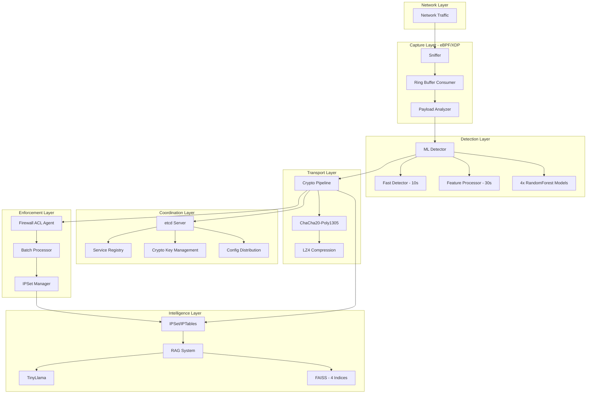

## Overview

ML Defender is an enterprise-grade distributed network security system built with a microservices architecture. Each component is designed for autonomy, resilience, and composability.

<Note>
  All components are production-validated with real metrics from stress testing.
</Note>

## Component Architecture



## Core Components

### 1. Sniffer (eBPF/XDP)

**Purpose**: High-performance packet capture and feature extraction

**Technology Stack**:
- eBPF/XDP for kernel-space filtering
- Ring buffer (4MB) for zero-copy data transfer
- Multi-threaded consumer pool
- libbpf CO-RE for portability

**Key Features**:
- **512-byte payload capture** - First 512 bytes of L4 payload
- **83+ ML features** - Comprehensive network behavior analysis
- **Three-layer detection pipeline**:
  - Layer 0: eBPF/XDP payload extraction
  - Layer 1.5: Payload analysis (entropy, PE headers, patterns)
  - Layer 1: Fast heuristics (10s sliding window)
  - Layer 2: Deep feature extraction (30s aggregation)

**Performance** (17-hour validation):
```
Runtime:              17h 2m 10s
Packets Processed:    2,080,549
Payloads Analyzed:    1,550,375 (74.5%)
Peak Throughput:      82.35 events/sec
Memory Footprint:     4.5 MB (stable)
CPU Usage:            5-10% (load), 0% (idle)
Crashes:              0
```

**Detection Capabilities**:
- Shannon entropy analysis (>7.0 bits = encrypted)
- PE executable detection (MZ/PE headers)
- 30+ ransomware signatures (.onion, crypto APIs, ransom notes)
- External IP tracking (C&C communication)
- SMB lateral movement detection
- Port scanning patterns

<Accordion title="Sniffer Configuration Example">
```json
{
  "interface": "eth0",
  "profile": "lab",
  "filter": {
    "mode": "hybrid",
    "excluded_ports": [22, 4444, 8080],
    "included_ports": [8000],
    "default_action": "capture"
  },
  "ransomware_detection": {
    "enabled": true,
    "fast_detector_window_ms": 10000,
    "feature_processor_interval_s": 30
  },
  "ring_buffer": {
    "size_mb": 4,
    "consumer_threads": 4
  }
}
```
</Accordion>

### 2. ML Detector

**Purpose**: Real-time threat classification using embedded ML models

**Technology Stack**:
- C++20 for performance
- ONNX Runtime for inference
- 4 embedded RandomForest models
- ZeroMQ PULL/PUB pattern

**Architecture - Three-Tier Detection**:

```
Event (83 features)
  ↓
🥇 Tier 1: Attack Detection (23 features, RF)
  ├─→ NO  → 🥉 Tier 3: Anomaly? (4 features)
  │         ├─→ NO  → LOG + END ✅
  │         └─→ YES → ANOMALY → Firewall
  │
  └─→ YES → 🥈 Tier 2: Classification (82 features, RF)
            ├─→ DDOS       → Firewall
            ├─→ RANSOMWARE → Firewall
            └─→ UNKNOWN    → Firewall
```

**Models**:
1. **DDoS Detection** - 97.6% accuracy on CTU-13 dataset
2. **Ransomware Detection** - Behavioral pattern classification
3. **Traffic Classification** - Protocol and flow analysis
4. **Anomaly Detection** - Internal vs external threats

**Performance**:
- Detection latency: &lt;1 μs (sub-microsecond)
- Throughput: 1M+ packets/sec (synthetic traffic)
- Features extracted: 83 per flow
- Models: 4 concurrent evaluations

<Accordion title="ML Detector Configuration Example">
```json
{
  "models": {
    "attack_detector": {
      "path": "/vagrant/models/attack_rf.onnx",
      "features": 23,
      "threshold": 0.7
    },
    "ddos_classifier": {
      "path": "/vagrant/models/ddos_rf.onnx",
      "features": 82,
      "threshold": 0.8
    },
    "ransomware_classifier": {
      "path": "/vagrant/models/ransomware_rf.onnx",
      "features": 82,
      "threshold": 0.85
    },
    "anomaly_detector": {
      "path": "/vagrant/models/anomaly_rf.onnx",
      "features": 4,
      "threshold": 0.75
    }
  },
  "zmq": {
    "input_endpoint": "tcp://127.0.0.1:5571",
    "output_endpoint": "tcp://127.0.0.1:5572"
  }
}
```
</Accordion>

### 3. Crypto Pipeline

**Purpose**: Secure, compressed transmission of threat data

**Technology Stack**:
- ChaCha20-Poly1305 (AEAD encryption)
- LZ4 fast compression
- libsodium crypto primitives

**Security Guarantees**:
- ✅ Authenticated encryption (AEAD)
- ✅ Perfect forward secrecy
- ✅ No cleartext transmission of threats
- ✅ 0 errors @ 36K events (production-validated)

**Performance** (36K event stress test):
```
crypto_errors:           0  ← Perfect
decompression_errors:    0  ← Perfect
protobuf_parse_errors:   0  ← Perfect
throughput:              364.9 events/sec
latency:                 <10ms (encryption + compression)
```

**Message Flow**:
1. ML Detector → Protobuf serialization
2. LZ4 compression (typical 50-70% reduction)
3. ChaCha20-Poly1305 encryption + authentication tag
4. ZeroMQ transmission
5. Firewall Agent → Decryption + verification
6. LZ4 decompression
7. Protobuf deserialization

### 4. etcd Server

**Purpose**: Distributed coordination and configuration management

**Technology Stack**:
- C++ implementation with etcd v3 API
- Key-value store with watch support
- Service discovery protocol

**Key Features**:
- ✅ Service registration & discovery
- ✅ Automatic crypto seed exchange
- ✅ Distributed configuration (JSON)
- ✅ Heartbeat mechanism (30s interval)
- ✅ Config versioning (master + active copies)

**Service Registration Protocol**:
```json
{
  "service_name": "ml-detector-1",
  "component_type": "ml-detector",
  "endpoint": "tcp://127.0.0.1:5572",
  "partner_ingester": "rag-ingester-1",
  "crypto_seed": "<base64-encoded-seed>",
  "heartbeat_interval_ms": 30000,
  "status": "active"
}
```

**Keyspace Organization**:
```
/ml-defender/
  ├── services/
  │   ├── sniffer-1
  │   ├── ml-detector-1
  │   ├── firewall-agent-1
  │   └── rag-ingester-1
  ├── config/
  │   ├── master/
  │   └── active/
  └── crypto/
      └── seeds/
```

### 5. Firewall ACL Agent

**Purpose**: Autonomous network threat blocking

**Technology Stack**:
- C++20 with IPSet/IPTables integration
- ZeroMQ SUB pattern for threat consumption
- ChaCha20-Poly1305 decryption
- LZ4 decompression

**Key Features**:
- ⚡ Kernel-level blocking (IPSet)
- 🕒 Temporal rules (auto-expire after 1h)
- 🚦 Rate limiting per IP
- ✅ Whitelist/blacklist support
- 🔄 Graceful rollback on exit
- 📊 Metrics export

**Performance** (Stress Test Results):

| Test | Events | Rate      | CPU    | Result |
|------|--------|-----------|--------|--------|
| 1    | 1,000  | 42.6/sec  | N/A    | ✅ PASS |
| 2    | 5,000  | 94.9/sec  | N/A    | ✅ PASS |
| 3    | 10,000 | 176.1/sec | 41-45% | ✅ PASS |
| 4    | 20,000 | 364.9/sec | 49-54% | ✅ PASS |

**Metrics (36K events total)**:
```
crypto_errors: 0              ← Perfect crypto pipeline
decompression_errors: 0       ← Perfect LZ4 pipeline
protobuf_parse_errors: 0      ← Perfect message parsing
ipset_successes: 118          ← First ~1000 blocked
ipset_failures: 16,681        ← Capacity limit (not a bug)
max_queue_depth: 16,690       ← Backpressure handled
memory_rss: 127 MB            ← Efficient under stress
```

**Config-Driven Architecture**:
- All parameters from JSON (zero hardcoding)
- IPSet names from config (no singleton ambiguity)
- Logging paths from config
- Batch processor tuning via JSON

<Accordion title="Firewall Agent Configuration Example">
```json
{
  "zmq": {
    "subscriber_endpoint": "tcp://127.0.0.1:5572",
    "hwm": 10000
  },
  "crypto": {
    "enabled": true,
    "seed_file": "/vagrant/config/crypto_seed.key",
    "algorithm": "chacha20-poly1305"
  },
  "ipsets": {
    "blacklist_test": {
      "name": "ml_defender_blacklist_test",
      "max_elements": 65536,
      "timeout": 3600
    }
  },
  "batch_processor": {
    "batch_size": 100,
    "flush_interval_ms": 1000
  },
  "logging": {
    "file": "/vagrant/logs/lab/firewall-agent.log",
    "level": "info"
  }
}
```
</Accordion>

### 6. RAG Ingester

**Purpose**: Log parsing and vector embedding generation

**Technology Stack**:
- Python with ONNX Runtime
- FAISS vector indexing
- Multi-threaded embedding pipeline
- crypto-transport library for decryption

**Multi-Index Strategy**:
1. **Chronos Index** (128-d temporal) - Time series queries
2. **SBERT Index** (96-d semantic) - Behavioral pattern queries
3. **Entity Benign Index** (64-d, 10% sampling) - Benign entity queries
4. **Entity Malicious Index** (64-d, 100% coverage) - Malicious entity queries

**Eventual Consistency**:
- Best-effort commits (indices commit independently)
- Availability > Consistency (better 3/4 indices than 0/4)
- Health tracking with circuit breakers

**Symbiosis with ml-detector**:
```
ml-detector → .pb files → rag-ingester → 4 FAISS indices → rag-client
              (encrypted,   (embeddings,
               compressed)    indexing)
```

**Threading Modes**:
- **Single-threaded** (Raspberry Pi safe): 1 embedding + 1 indexing worker
- **Multi-threaded** (server): 3 embedding + 4 indexing workers

**Resource Footprint**:
- Minimal memory: ~310MB (Raspberry Pi compatible)
- Scales to 64-core servers with multi-threading

### 7. RAG System

**Purpose**: Natural language forensic queries over threat data

**Technology Stack**:
- TinyLlama for language understanding
- FAISS for vector similarity search
- ZeroMQ for IPC
- etcd for distributed coordination

**Key Features**:
- 📋 Command whitelist (security control)
- 🤖 LLM integration (llama.cpp)
- 🔄 etcd client for config
- 🔐 Security context and audit logging
- 🎯 Command validator

**Query Examples**:
```
User: "¿Qué ha ocurrido en la casa en las últimas 24h?"
RAG:  "Detected 15 ransomware events from 3 IPs, blocked 8 C&C connections..."

User: "Show me all DDoS attacks from China"
RAG:  "Found 42 DDoS events: 38 volumetric, 4 application-layer..."

User: "Which IPs are in the current blacklist?"
RAG:  "118 IPs blocked: 67 ransomware, 31 DDoS, 20 port scanning..."
```

**Security Model**:
- Whitelist-only command execution
- Regex pattern validation
- Restricted key access (no root/admin/password)
- Full audit trail of decisions

## Communication Patterns

### ZeroMQ Topology

**Pattern**: Publisher-Subscriber with PUSH-PULL for backpressure

```
Sniffer ──PUSH──> ML Detector ──PUB──> Firewall Agent
   |                    |                    |
   └─────────────────────────────────────────┴──> RAG Ingester
```

**Endpoints**:
- Sniffer → ML Detector: `tcp://127.0.0.1:5571`
- ML Detector → Firewall Agent: `tcp://127.0.0.1:5572`
- ML Detector → RAG Ingester: File-based (.pb files)

**Message Format**: Protocol Buffers (network_security.proto)

```protobuf
message NetworkSecurityEvent {
  string src_ip = 1;
  string dst_ip = 2;
  uint32 src_port = 3;
  uint32 dst_port = 4;
  uint32 protocol = 5;
  uint64 timestamp = 6;
  
  // ML features (83 total)
  float flow_duration = 7;
  uint32 total_fwd_packets = 8;
  uint32 total_bwd_packets = 9;
  // ... 80 more features
  
  // Detection results
  string threat_type = 90;  // "DDOS", "RANSOMWARE", "ANOMALY"
  float confidence = 91;
  repeated string indicators = 92;
}
```

### Protobuf Serialization

**Why Protobuf?**
- Compact binary format (50-70% smaller than JSON)
- Schema evolution (backwards compatible)
- Fast serialization/deserialization
- Cross-language support (C++, Python)

**Message Flow**:
1. Sniffer extracts features → Protobuf struct
2. ML Detector adds predictions → Same Protobuf
3. Crypto pipeline encrypts → Binary blob
4. Firewall Agent decrypts → Protobuf struct
5. RAG Ingester parses → Vector embeddings

## Deployment Topology

### Single-Node Deployment

**Use case**: Development, small networks (&lt;100 hosts)

```
┌─────────────────────────────────────┐
│  Single Server (8GB RAM, 6 CPU)     │
│                                     │
│  ┌─────────┐  ┌──────────┐         │
│  │ Sniffer │→ │ML Detector│         │
│  └─────────┘  └──────────┘         │
│       ↓             ↓               │
│  ┌─────────┐  ┌──────────┐         │
│  │  etcd   │←→│ Firewall │         │
│  └─────────┘  └──────────┘         │
│       ↓             ↓               │
│  ┌─────────┐  ┌──────────┐         │
│  │   RAG   │←─│ Ingester │         │
│  └─────────┘  └──────────┘         │
└─────────────────────────────────────┘
```

**Resource Requirements**:
- RAM: 8GB minimum
- CPU: 6 cores recommended
- Disk: 50GB (20GB logs + 30GB models/indices)
- Network: 1Gbps NIC

### Dual-NIC Gateway Deployment

**Use case**: Network gateway, protecting entire LAN

```
┌──────────────────────────────────────────┐
│  ML Defender Gateway                     │
│                                          │
│  ┌────────┐              ┌────────┐     │
│  │  eth1  │ (WAN)        │  eth3  │     │
│  │ XDP=3  │              │ XDP=5  │     │
│  └───┬────┘              └───┬────┘     │
│      │                       │          │
│      └───────┬───────────────┘          │
│              ↓                           │
│         ┌─────────┐                     │
│         │ Sniffer │ (Dual-NIC mode)     │
│         └─────────┘                     │
│              ↓                           │
│         [ML Pipeline]                   │
└──────────────────────────────────────────┘
         ↑                    ↓
    Internet            Protected LAN
  (192.168.56.1)      (192.168.100.0/24)
```

**Configuration**:
- Host-based mode (eth1): Packets TO gateway
- Gateway mode (eth3): Packets THROUGH gateway
- IP forwarding enabled
- eBPF programs on both interfaces

**Traffic Flow**:
1. Client (192.168.100.50) → eth3 (gateway mode)
2. XDP captures transit traffic
3. ML Detector classifies
4. Firewall Agent blocks if malicious
5. Legitimate traffic forwarded to Internet via eth1

<Warning>
  Dual-NIC mode requires `net.ipv4.ip_forward=1` and `rp_filter=0` on all interfaces.
</Warning>

### Multi-Node Distributed Deployment

**Use case**: Large networks, high availability

```
┌──────────────────────────────────────────────┐
│  Cluster 1 (Edge)                            │
│  ┌─────────┐  ┌─────────┐  ┌─────────┐      │
│  │Sniffer 1│  │Sniffer 2│  │Sniffer 3│      │
│  └────┬────┘  └────┬────┘  └────┬────┘      │
│       │            │            │            │
│       └────────────┼────────────┘            │
│                    ↓                         │
└────────────────────┼─────────────────────────┘
                     │
┌────────────────────┼─────────────────────────┐
│  Cluster 2 (Core)  ↓                         │
│  ┌──────────────────────────┐                │
│  │   Load Balancer (ZMQ)    │                │
│  └────────┬─────────────────┘                │
│           ↓                                  │
│  ┌─────────┐  ┌─────────┐  ┌─────────┐      │
│  │ML Det 1 │  │ML Det 2 │  │ML Det 3 │      │
│  └─────────┘  └─────────┘  └─────────┘      │
│       │            │            │            │
└───────┼────────────┼────────────┼────────────┘
        │            │            │
┌───────┼────────────┼────────────┼────────────┐
│  Cluster 3 (Storage) ↓                       │
│  ┌────────────────────────────┐              │
│  │   etcd Cluster (3 nodes)   │              │
│  └────────────────────────────┘              │
│  ┌────────────────────────────┐              │
│  │  Firewall Agents (3 nodes) │              │
│  └────────────────────────────┘              │
│  ┌────────────────────────────┐              │
│  │     RAG Cluster            │              │
│  │  (Ingester + Query nodes)  │              │
│  └────────────────────────────┘              │
└──────────────────────────────────────────────┘
```

**Features**:
- Horizontal scaling (add more sniffers)
- Load balancing across ML detectors
- etcd cluster for HA coordination
- Shared FAISS indices (NFS/Ceph)
- Prometheus + Grafana monitoring

## Next Steps

<CardGroup cols={2}>
  <Card
    title="Component Deep Dives"
    icon="magnifying-glass"
    href="/components"
  >
    Detailed documentation for each component
  </Card>
  
  <Card
    title="Deployment Guide"
    icon="rocket"
    href="/operations/deployment"
  >
    Step-by-step deployment instructions
  </Card>
  
  <Card
    title="Configuration Reference"
    icon="gear"
    href="/operations/configuration"
  >
    Complete configuration options for all components
  </Card>
  
  <Card
    title="Performance Tuning"
    icon="gauge-high"
    href="/operations/performance"
  >
    Optimization tips and benchmarking
  </Card>
</CardGroup>
