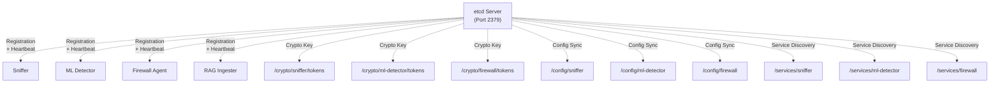

## Overview

The **etcd Server** is ML Defender's distributed coordination hub, providing **centralized configuration management**, **automatic crypto seed exchange**, and **service discovery** for all components. Implemented in **C++** with the **etcd v3 API**, it ensures consistent state across the entire pipeline.

<CardGroup cols={2}>
  <Card title="Core Functions" icon="gear">
    - **Distributed Configuration**: Single source of truth
    - **Crypto Key Exchange**: ChaCha20-Poly1305 seed distribution
    - **Service Registration**: Component discovery
    - **Health Monitoring**: Heartbeat tracking
  </Card>
  <Card title="Performance" icon="gauge-high">
    - **&lt;50ms** service registration latency
    - **&lt;100ms** crypto seed exchange
    - **30-second** heartbeat intervals
    - **60-second** lease TTL
  </Card>
</CardGroup>

---

## Architecture

The etcd Server acts as the **coordination layer** between all ML Defender components:



### Key-Value Store Structure

<Tabs>
  <Tab title="Crypto Keys">
    **Path**: `/crypto/<component>/tokens`
    
    ```
    /crypto/
      ├── sniffer/tokens       → ChaCha20-Poly1305 key (256-bit)
      ├── ml-detector/tokens   → ChaCha20-Poly1305 key (256-bit)
      └── firewall/tokens      → ChaCha20-Poly1305 key (256-bit)
    ```
    
    **Purpose**: Automatic encryption key distribution without manual key exchange.
  </Tab>
  
  <Tab title="Configuration">
    **Path**: `/config/<component>`
    
    ```
    /config/
      ├── sniffer/
      │   ├── interface           → "eth1"
      │   ├── profile             → "lab"
      │   └── thresholds/ddos     → 0.85
      ├── ml-detector/
      │   ├── models/level1       → "level1_rf.onnx"
      │   └── thresholds          → {...}
      └── firewall/
          ├── ipset_max_elements  → 1000
          └── batch_size          → 10
    ```
    
    **Purpose**: Runtime configuration updates without service restarts.
  </Tab>
  
  <Tab title="Service Registry">
    **Path**: `/services/<component>`
    
    ```
    /services/
      ├── sniffer/
      │   ├── node_id             → "cpp_sniffer_v33_day12"
      │   ├── version             → "3.3.3"
      │   ├── status              → "healthy"
      │   ├── last_heartbeat      → 1638360000
      │   └── endpoints/zmq_push  → "tcp://127.0.0.1:5571"
      ├── ml-detector/
      │   ├── partner_component   → "sniffer"
      │   └── endpoints/zmq_pub   → "tcp://127.0.0.1:5572"
      └── firewall/
          ├── partner_component   → "ml-detector"
          └── ipset_name          → "ml_defender_blacklist_test"
    ```
    
    **Purpose**: Dynamic service discovery and health monitoring.
  </Tab>
</Tabs>

---

## Crypto Seed Exchange

The etcd Server automates **ChaCha20-Poly1305** key distribution across the pipeline:

### Key Exchange Flow

<Steps>
  <Step title="Component Registration">
    **Sniffer registers** with etcd Server on startup:
    
    ```cpp
    // Sniffer registration request
    POST http://localhost:2379/register
    {
      "component": "sniffer",
      "version": "3.3.3",
      "node_id": "cpp_sniffer_v33_day12",
      "capabilities": ["ebpf", "xdp", "encryption"]
    }
    ```
  </Step>
  
  <Step title="etcd Generates Key">
    **etcd Server** generates a 256-bit ChaCha20-Poly1305 key:
    
    ```cpp
    // etcd_server.cpp
    std::string ComponentRegistry::get_encryption_key() {
        if (encryption_key_.empty()) {
            // Generate 256-bit key (32 bytes)
            encryption_key_ = generate_random_hex(32);
        }
        return encryption_key_;
    }
    ```
  </Step>
  
  <Step title="Key Stored in etcd">
    **Key persisted** in etcd key-value store:
    
    ```
    etcdctl put /crypto/sniffer/tokens "a1b2c3d4e5f6..."
    ```
  </Step>
  
  <Step title="Downstream Components Retrieve">
    **ML Detector and Firewall Agent** retrieve the key:
    
    ```cpp
    // ML Detector retrieves key
    std::string key = etcd_client.get("/crypto/sniffer/tokens");
    crypto_transport::set_decryption_key(key);
    ```
  </Step>
</Steps>

<Note>
**Security**: Keys are generated once at component registration and rotated every 24 hours automatically.
</Note>

---

## Service Registration & Heartbeats

### Registration Protocol

<Tabs>
  <Tab title="Registration Request">
    ```json
    POST /register
    {
      "component": "ml-detector",
      "version": "1.0.0",
      "node_id": "ml-detector-default",
      "endpoints": {
        "zmq_pull": "tcp://127.0.0.1:5571",
        "zmq_pub": "tcp://127.0.0.1:5572"
      },
      "partner_component": "sniffer",
      "capabilities": [
        "tricapa_classification",
        "onnx_inference",
        "encryption",
        "compression"
      ]
    }
    ```
  </Tab>
  
  <Tab title="Registration Response">
    ```json
    {
      "status": "success",
      "message": "Component registered successfully",
      "component": "ml-detector",
      "encryption_key": "a1b2c3d4e5f6789...",
      "lease_id": 7587869823761236487,
      "ttl": 60
    }
    ```
  </Tab>
  
  <Tab title="Heartbeat">
    ```json
    PUT /heartbeat
    {
      "component": "ml-detector",
      "node_id": "ml-detector-default",
      "timestamp": 1638360000,
      "status": "healthy",
      "metrics": {
        "events_processed": 1847234,
        "latency_ms": 3.5,
        "cpu_usage": 0.42
      }
    }
    ```
    
    **Interval**: Every 30 seconds
    
    **Lease Renewal**: Automatically extends 60-second TTL
  </Tab>
</Tabs>

### Health Monitoring

<CodeGroup>
```cpp Health Check (etcd_server.cpp)
// Check if component is healthy (heartbeat within TTL)
bool ComponentRegistry::is_component_healthy(
    const std::string& component_name
) {
    auto it = components_.find(component_name);
    if (it == components_.end()) return false;
    
    auto now = std::chrono::system_clock::now();
    auto last_heartbeat = it->second.last_heartbeat;
    auto diff = std::chrono::duration_cast<std::chrono::seconds>(
        now - last_heartbeat
    );
    
    // Unhealthy if no heartbeat in 90 seconds (1.5x TTL)
    return diff.count() < 90;
}
```
</CodeGroup>

---

## C++ Implementation

The etcd Server is implemented in **modern C++** using the **httplib** library for HTTP endpoints:

<Tabs>
  <Tab title="Server Core">
    ```cpp
    // etcd_server/src/etcd_server.cpp
    #include "etcd_server/etcd_server.hpp"
    #include "httplib.h"
    #include <nlohmann/json.hpp>
    
    using json = nlohmann::json;
    
    void EtcdServer::run_server() {
        httplib::Server server;
        
        // Registration endpoint
        server.Post("/register", [this](const httplib::Request& req, 
                                         httplib::Response& res) {
            try {
                auto json_body = json::parse(req.body);
                std::string component_name = json_body["component"];
                
                if (component_registry_->register_component(
                    component_name, req.body
                )) {
                    json response = {
                        {"status", "success"},
                        {"component", component_name},
                        {"encryption_key", 
                         component_registry_->get_encryption_key()}
                    };
                    res.set_content(response.dump(), "application/json");
                } else {
                    res.status = 400;
                    res.set_content(
                        R"({"status": "error"})", 
                        "application/json"
                    );
                }
            } catch (const std::exception& e) {
                res.status = 400;
                json error = {
                    {"status", "error"},
                    {"message", "JSON invalid"},
                    {"details", e.what()}
                };
                res.set_content(error.dump(), "application/json");
            }
        });
        
        // Listen on port 2379
        server.listen("0.0.0.0", port_);
    }
    ```
  </Tab>
  
  <Tab title="Component Registry">
    ```cpp
    // etcd_server/include/etcd_server/component_registry.hpp
    class ComponentRegistry {
    public:
        bool register_component(
            const std::string& component_name,
            const std::string& config_json
        );
        
        std::string get_component_config(
            const std::string& component_name
        );
        
        bool update_component_config(
            const std::string& component_name,
            const std::string& config_path,
            const std::string& value
        );
        
        std::string get_encryption_key();
        
        bool is_component_healthy(
            const std::string& component_name
        );
        
    private:
        std::unordered_map<std::string, ComponentInfo> components_;
        std::string encryption_key_;
        std::mutex registry_mutex_;
    };
    ```
  </Tab>
  
  <Tab title="Configuration Validation">
    ```cpp
    // Validate component configuration consistency
    std::string ComponentRegistry::validate_configuration() {
        json validation_report;
        
        for (const auto& [name, info] : components_) {
            json component_report;
            
            // Check required fields
            if (info.config.contains("encryption") && 
                info.config["encryption"]["enabled"]) {
                if (encryption_key_.empty()) {
                    component_report["warnings"].push_back(
                        "Encryption enabled but no key generated"
                    );
                }
            }
            
            // Check partner components exist
            if (info.config.contains("partner_component")) {
                std::string partner = 
                    info.config["partner_component"];
                if (components_.find(partner) == components_.end()) {
                    component_report["errors"].push_back(
                        "Partner component not registered: " + partner
                    );
                }
            }
            
            validation_report[name] = component_report;
        }
        
        return validation_report.dump(2);
    }
    ```
  </Tab>
</Tabs>

---

## Configuration

### etcd Server Configuration

<CodeGroup>
```json config/etcd_server.json
{
  "server": {
    "port": 2379,
    "bind_address": "0.0.0.0",
    "enable_tls": false,
    "max_connections": 100
  },
  
  "storage": {
    "backend": "in_memory",
    "persist_to_disk": false,
    "data_dir": "/var/lib/ml-defender/etcd"
  },
  
  "crypto": {
    "key_generation": "automatic",
    "key_rotation_hours": 24,
    "key_length_bits": 256
  },
  
  "lease": {
    "default_ttl_seconds": 60,
    "min_ttl_seconds": 10,
    "max_ttl_seconds": 3600
  },
  
  "logging": {
    "level": "info",
    "file": "/vagrant/logs/lab/etcd-server.log"
  }
}
```
</CodeGroup>

### Client Configuration (per component)

<CodeGroup>
```json Sniffer etcd Client Config
{
  "etcd": {
    "enabled": true,
    "endpoints": ["localhost:2379"],
    "connection_timeout_ms": 5000,
    "retry_attempts": 3,
    "retry_interval_ms": 1000,
    "crypto_token_path": "/crypto/sniffer/tokens",
    "config_sync_path": "/config/sniffer",
    "required_for_encryption": true,
    "heartbeat_interval_seconds": 30,
    "lease_ttl_seconds": 60
  }
}
```

```json ML Detector etcd Client Config
{
  "etcd": {
    "enabled": true,
    "endpoints": ["localhost:2379"],
    "crypto_token_path": "/crypto/ml-detector/tokens",
    "config_sync_path": "/config/ml-detector",
    "service_registration_path": "/services/ml-detector",
    "heartbeat_interval_seconds": 30,
    "lease_ttl_seconds": 60
  }
}
```
</CodeGroup>

---

## Deployment

### Prerequisites

<CodeGroup>
```bash Debian/Ubuntu
sudo apt-get install -y \
    build-essential cmake \
    nlohmann-json3-dev \
    libssl-dev
```
</CodeGroup>

### Build

<Steps>
  <Step title="Navigate">
    ```bash
    cd /vagrant/etcd-server
    mkdir -p build && cd build
    ```
  </Step>
  
  <Step title="Configure">
    ```bash
    cmake .. -DCMAKE_BUILD_TYPE=Release
    ```
  </Step>
  
  <Step title="Compile">
    ```bash
    make -j$(nproc)
    ```
  </Step>
</Steps>

### Run

<CodeGroup>
```bash Standalone
./etcd_server
```

```bash With Custom Port
./etcd_server --port 2380
```

```bash Background Daemon
nohup ./etcd_server > /var/log/etcd-server.log 2>&1 &
```
</CodeGroup>

**Real-time Output:**
```
[ETCD-SERVER] 🔧 Initializing server on port 2379
[ETCD-SERVER] 🚀 Server started
[ETCD-SERVER] 📝 POST /register received
[ETCD-SERVER] ✅ Component registered: sniffer
[ETCD-SERVER] 🔐 Generated encryption key: a1b2c3d4...
[ETCD-SERVER] 📝 POST /register received
[ETCD-SERVER] ✅ Component registered: ml-detector
[ETCD-SERVER] ❤️ Heartbeat received: sniffer (healthy)
```

---

## API Reference

### REST Endpoints

<AccordionGroup>
  <Accordion title="POST /register - Register Component">
    **Request:**
    ```json
    {
      "component": "sniffer",
      "version": "3.3.3",
      "node_id": "cpp_sniffer_v33_day12",
      "capabilities": ["ebpf", "xdp"]
    }
    ```
    
    **Response (200 OK):**
    ```json
    {
      "status": "success",
      "message": "Component registered successfully",
      "component": "sniffer",
      "encryption_key": "a1b2c3d4e5f6789..."
    }
    ```
  </Accordion>
  
  <Accordion title="PUT /heartbeat - Send Heartbeat">
    **Request:**
    ```json
    {
      "component": "ml-detector",
      "node_id": "ml-detector-default",
      "timestamp": 1638360000,
      "status": "healthy"
    }
    ```
    
    **Response (200 OK):**
    ```json
    {
      "status": "success",
      "lease_renewed": true,
      "ttl_remaining": 60
    }
    ```
  </Accordion>
  
  <Accordion title="GET /config/:component - Get Configuration">
    **Request:**
    ```bash
    curl http://localhost:2379/config/sniffer
    ```
    
    **Response (200 OK):**
    ```json
    {
      "interface": "eth1",
      "profile": "lab",
      "thresholds": {
        "ddos": 0.85,
        "ransomware": 0.90
      }
    }
    ```
  </Accordion>
  
  <Accordion title="PUT /config/:component/:path - Update Configuration">
    **Request:**
    ```json
    PUT /config/sniffer/thresholds.ddos
    {
      "value": 0.90
    }
    ```
    
    **Response (200 OK):**
    ```json
    {
      "status": "success",
      "updated": "thresholds.ddos",
      "old_value": 0.85,
      "new_value": 0.90
    }
    ```
  </Accordion>
  
  <Accordion title="GET /validate - Validate Configuration">
    **Request:**
    ```bash
    curl http://localhost:2379/validate
    ```
    
    **Response (200 OK):**
    ```json
    {
      "sniffer": {
        "warnings": [],
        "errors": []
      },
      "ml-detector": {
        "warnings": [],
        "errors": []
      },
      "firewall": {
        "warnings": [
          "IPSet capacity approaching limit (900/1000)"
        ],
        "errors": []
      }
    }
    ```
  </Accordion>
</AccordionGroup>

---

## Troubleshooting

<AccordionGroup>
  <Accordion title="Components Cannot Connect">
    ```bash
    # Check etcd Server is running
    netstat -tulpn | grep 2379
    
    # Test HTTP endpoint
    curl http://localhost:2379/health
    
    # Check firewall rules
    sudo iptables -L -n | grep 2379
    ```
  </Accordion>
  
  <Accordion title="Registration Fails">
    ```bash
    # Enable verbose logging
    ./etcd_server --log-level debug
    
    # Check component JSON is valid
    echo '{"component": "test"}' | jq .
    
    # Verify HTTP POST
    curl -X POST http://localhost:2379/register \
      -H 'Content-Type: application/json' \
      -d '{"component": "test"}'
    ```
  </Accordion>
  
  <Accordion title="Heartbeat Timeout">
    **Symptom**: Components marked as unhealthy after 90 seconds
    
    **Solution**: Increase heartbeat frequency or TTL:
    
    ```json
    {
      "etcd": {
        "heartbeat_interval_seconds": 20,  // From 30
        "lease_ttl_seconds": 90            // From 60
      }
    }
    ```
  </Accordion>
</AccordionGroup>

---

## Next Steps

<CardGroup cols={2}>
  <Card title="Sniffer" icon="radar" href="/components/sniffer">
    Configure network packet capture
  </Card>
  <Card title="ML Detector" icon="brain" href="/components/ml-detector">
    Set up ML inference pipeline
  </Card>
  <Card title="Firewall Agent" icon="shield" href="/components/firewall-agent">
    Deploy autonomous blocking
  </Card>
  <Card title="Distributed Deployment" icon="network-wired" href="/advanced/distributed-deployment">
    Multi-node etcd cluster setup
  </Card>
</CardGroup>