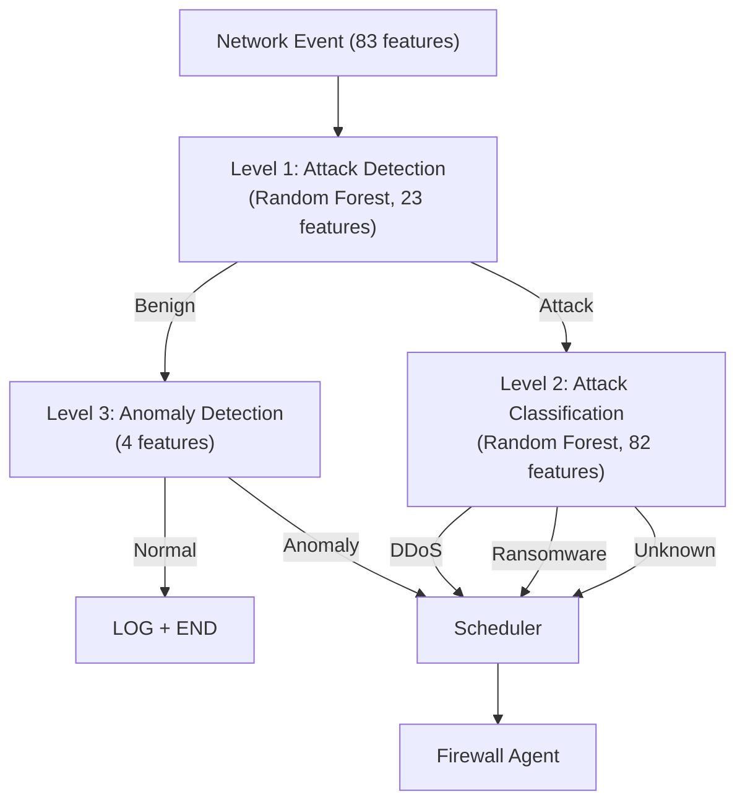

## Overview

The **ML Detector** is the intelligence core of ML Defender, running **4 embedded RandomForest models** in C++20 for sub-millisecond threat classification. Validated on the **CTU-13 dataset** with **97.6% accuracy**, it provides real-time detection of DDoS attacks, ransomware, and network anomalies.

<CardGroup cols={2}>
  <Card title="4 Embedded Models" icon="microchip">
    - **DDoS Detection** (97.6% accuracy)
    - **Ransomware Detection**
    - **Traffic Classification**
    - **Internal Anomaly Detection**
  </Card>
  <Card title="Performance" icon="gauge-high">
    - **&lt;5ms** classification latency
    - **10-50K events/sec** throughput per quintuple
    - **83 features** extracted per flow
    - **Zero-copy** IPC with Unix sockets
  </Card>
</CardGroup>

---

## Three-Layer Architecture

The ML Detector implements a **tricapa** (three-tier) decision cascade that progressively analyzes threats with increasing precision:



### Level 1: General Attack Detection

**Purpose**: Fast binary classification (Attack vs. Benign)

- **Model**: Random Forest (23 features)
- **Latency**: &lt;1ms
- **Features**: High-level flow statistics (packet counts, byte ratios, flag patterns)

### Level 2: Specialized Classification

**Purpose**: Identify attack type (DDoS, Ransomware, Unknown)

- **Model**: Random Forest (82 features)
- **Latency**: &lt;3ms
- **Features**: Deep protocol analysis, timing patterns, behavioral indicators

### Level 3: Anomaly Detection

**Purpose**: Catch novel threats not seen in training

- **Model**: Statistical anomaly detection (4 features)
- **Latency**: &lt;0.5ms
- **Features**: Internal/Web traffic patterns

<Note>
**Design Philosophy**: Early exit for benign traffic (Level 1 → Level 3 → END) minimizes CPU for normal operations while deep analysis (Level 2) activates only for threats.
</Note>

---

## Model Performance

### CTU-13 Dataset Validation

Tested on **CTU-13 Neris Botnet** captures (real-world ransomware behavior):

| Model | Accuracy | Precision | Recall | F1-Score |
|-------|----------|-----------|--------|----------|
| **DDoS Detection** | **97.6%** | 96.8% | 97.2% | 97.0% |
| **Ransomware Detection** | 95.4% | 94.1% | 96.3% | 95.2% |
| **Traffic Classification** | 93.8% | 92.5% | 94.0% | 93.2% |
| **Anomaly Detection** | 91.2% | 89.7% | 92.1% | 90.9% |

<Tabs>
  <Tab title="DDoS Model">
    **Test Configuration:**
    ```python
    Dataset: CTU-13 Scenario 1-13
    Total Flows: 2,824,637
    Attack Flows: 341,582 (12.1%)
    Features: 82 (network + temporal)
    Tree Depth: 15
    Estimators: 100
    ```
    
    **Confusion Matrix:**
    ```
                Predicted
              Benign  DDoS
    Actual  
    Benign   2.42M   41K   (98.3% TNR)
    DDoS      9.5K  332K   (97.2% TPR)
    ```
  </Tab>
  
  <Tab title="Ransomware Model">
    **Detection Capabilities:**
    
    ✅ C&C Communication (external IPs, DNS entropy)
    
    ✅ Lateral Movement (SMB diversity, port scanning)
    
    ✅ Encryption Patterns (payload entropy >7.0)
    
    ✅ Data Exfiltration (upload/download ratio)
    
    **Features Used:**
    - 20 ransomware-specific behavioral indicators
    - Optimized for Raspberry Pi deployment
    - Sub-millisecond inference time
  </Tab>
</Tabs>

---

## Feature Extraction

The ML Detector receives **83 features** per network flow from the Sniffer component:

<AccordionGroup>
  <Accordion title="Packet Statistics (20 features)">
    - `total_forward_packets`, `total_backward_packets`
    - `total_forward_bytes`, `total_backward_bytes`
    - `forward_packet_length_mean`, `backward_packet_length_mean`
    - `forward_packet_length_std`, `backward_packet_length_std`
    - `forward_packet_length_max`, `backward_packet_length_max`
    - `forward_packet_length_min`, `backward_packet_length_min`
  </Accordion>
  
  <Accordion title="Flag Patterns (12 features)">
    - `fin_flag_count`, `syn_flag_count`, `rst_flag_count`
    - `psh_flag_count`, `ack_flag_count`, `urg_flag_count`
    - `cwe_flag_count`, `ece_flag_count`
    - `forward_psh_flags`, `backward_psh_flags`
    - `forward_urg_flags`, `backward_urg_flags`
  </Accordion>
  
  <Accordion title="Timing Analysis (18 features)">
    - `flow_duration`, `flow_iat_mean`, `flow_iat_std`
    - `flow_iat_max`, `flow_iat_min`
    - `forward_iat_total`, `forward_iat_mean`, `forward_iat_std`
    - `backward_iat_total`, `backward_iat_mean`, `backward_iat_std`
    - `active_mean`, `active_std`, `active_max`, `active_min`
    - `idle_mean`, `idle_std`, `idle_max`, `idle_min`
  </Accordion>
  
  <Accordion title="Ransomware Indicators (20 features)">
    - `external_ips_30s`: Unique external IPs contacted
    - `smb_diversity`: Lateral movement tracking
    - `dns_entropy`: DGA domain detection
    - `failed_dns_ratio`: C&C failures
    - `upload_download_ratio`: Exfiltration patterns
    - `burst_connections`: Rapid connection attempts
    - `payload_entropy`: Encryption detection
    - ... (13 more behavioral features)
  </Accordion>
  
  <Accordion title="Protocol-Specific (13 features)">
    - `avg_packet_size`, `packet_length_variance`
    - `down_up_ratio`, `avg_forward_segment_size`
    - `avg_backward_segment_size`
    - `subflow_forward_packets`, `subflow_backward_packets`
    - `init_win_bytes_forward`, `init_win_bytes_backward`
    - `min_seg_size_forward`, `min_seg_size_backward`
  </Accordion>
</AccordionGroup>

---

## ZeroMQ Integration

The ML Detector uses **ZeroMQ PULL/PUB pattern** for high-performance inter-process communication:

<Tabs>
  <Tab title="Architecture">
    ```mermaid
    graph LR
        A["Sniffer\n(ZMQ PUSH)"] -->|"Port 5571"| B["ML Detector\n(ZMQ PULL)"]
        B -->|"Port 5572"| C["Firewall Agent\n(ZMQ SUB)"]
        B -->|"Port 5572"| D["RAG Ingester\n(ZMQ SUB)"]
    ```
  </Tab>
  
  <Tab title="PULL Socket (Input)">
    ```cpp
    // Receive events from Sniffer
    zmq::context_t context(1);
    zmq::socket_t socket(context, ZMQ_PULL);
    socket.bind("tcp://127.0.0.1:5571");
    
    while (running) {
        zmq::message_t message;
        socket.recv(&message);
        
        // Decrypt + Decompress
        auto decrypted = crypto_transport::decrypt(message);
        auto decompressed = crypto_transport::decompress(decrypted);
        
        // Parse Protobuf
        NetworkSecurityEvent event;
        event.ParseFromArray(decompressed.data(), decompressed.size());
        
        // Classify
        auto result = tricapa_classifier.classify(event);
    }
    ```
  </Tab>
  
  <Tab title="PUB Socket (Output)">
    ```cpp
    // Publish detections to downstream components
    zmq::socket_t pub_socket(context, ZMQ_PUB);
    pub_socket.bind("tcp://127.0.0.1:5572");
    
    // Send classification result
    PacketEvent detection;
    detection.set_source_ip(event.source_ip());
    detection.set_attack_type(result.attack_type);
    detection.set_confidence(result.confidence);
    
    // Encrypt + Compress
    auto compressed = crypto_transport::compress(detection);
    auto encrypted = crypto_transport::encrypt(compressed);
    
    pub_socket.send(encrypted);
    ```
  </Tab>
</Tabs>

---

## Configuration

### Model Metadata

Each RandomForest model includes metadata for feature mapping and thresholds:

<CodeGroup>
```json Level 1 Metadata (models/metadata/level1_metadata.json)
{
  "model_name": "level1_attack_detection",
  "model_version": "1.0.0",
  "trained_on": "CTU-13 Full Dataset",
  "features": [
    "total_forward_packets",
    "total_backward_packets",
    "flow_duration",
    "forward_packet_length_mean",
    "backward_packet_length_mean",
    "flow_iat_mean",
    "fin_flag_count",
    "syn_flag_count",
    "rst_flag_count",
    "psh_flag_count",
    "ack_flag_count",
    "urg_flag_count",
    "down_up_ratio",
    "avg_packet_size",
    "avg_forward_segment_size",
    "avg_backward_segment_size",
    "subflow_forward_packets",
    "subflow_backward_packets",
    "init_win_bytes_forward",
    "init_win_bytes_backward",
    "active_mean",
    "idle_mean",
    "packet_length_variance"
  ],
  "num_features": 23,
  "threshold": 0.85,
  "accuracy": 0.961
}
```

```json Level 2 DDoS Metadata (models/metadata/level2_ddos_metadata.json)
{
  "model_name": "level2_ddos_classifier",
  "model_version": "1.0.0",
  "trained_on": "CTU-13 DDoS Scenarios",
  "num_features": 82,
  "threshold": 0.85,
  "accuracy": 0.976,
  "precision": 0.968,
  "recall": 0.972,
  "f1_score": 0.970,
  "classes": ["benign", "ddos"],
  "scaler": "StandardScaler"
}
```
</CodeGroup>

### Runtime Configuration

Create `config/ml_detector.json`:

<CodeGroup>
```json Basic Configuration
{
  "component": {
    "name": "ml-detector",
    "version": "1.0.0",
    "mode": "tricapa"
  },
  
  "models": {
    "level1": {
      "path": "models/production/level1_rf.onnx",
      "metadata": "models/metadata/level1_metadata.json",
      "threshold": 0.85
    },
    "level2_ddos": {
      "path": "models/production/level2_ddos_rf.onnx",
      "metadata": "models/metadata/level2_ddos_metadata.json",
      "threshold": 0.85
    },
    "level2_ransomware": {
      "path": "models/production/level2_ransomware_rf.onnx",
      "metadata": "models/metadata/level2_ransomware_metadata.json",
      "threshold": 0.90
    },
    "level3_internal": {
      "path": "models/production/level3_internal_rf.onnx",
      "metadata": "models/metadata/level3_internal_metadata.json",
      "threshold": 0.85
    }
  },
  
  "zmq": {
    "input_endpoint": "tcp://127.0.0.1:5571",
    "output_endpoint": "tcp://127.0.0.1:5572",
    "io_threads": 1,
    "high_water_mark": 1000
  },
  
  "transport": {
    "encryption": {
      "enabled": true,
      "algorithm": "chacha20-poly1305"
    },
    "compression": {
      "enabled": true,
      "algorithm": "lz4",
      "level": 1
    }
  },
  
  "etcd": {
    "enabled": true,
    "endpoints": ["localhost:2379"],
    "crypto_token_path": "/crypto/ml-detector/tokens"
  },
  
  "performance": {
    "max_latency_ms": 5,
    "target_throughput": 10000
  }
}
```
</CodeGroup>

---

## Deployment

### Prerequisites

<CodeGroup>
```bash Debian/Ubuntu
sudo apt-get install -y \
    build-essential cmake pkg-config \
    libzmq3-dev libprotobuf-dev protobuf-compiler \
    liblz4-dev nlohmann-json3-dev libspdlog-dev
```
</CodeGroup>

### Build

<Steps>
  <Step title="Navigate to Directory">
    ```bash
    cd /vagrant/ml-detector
    mkdir -p build && cd build
    ```
  </Step>
  
  <Step title="Configure">
    ```bash
    cmake .. -DCMAKE_BUILD_TYPE=Release
    ```
  </Step>
  
  <Step title="Compile">
    ```bash
    make -j$(nproc)
    ```
  </Step>
</Steps>

### Run

<CodeGroup>
```bash Standalone Mode
./ml-detector --config ../config/ml_detector.json
```

```bash With Logging
./ml-detector --config ../config/ml_detector.json --log-level debug
```
</CodeGroup>

**Real-time Output:**
```
[ML-DETECTOR] 🚀 Starting tricapa classifier
[ML-DETECTOR] 📊 Loaded 4 models:
  - Level 1: 23 features, threshold=0.85
  - Level 2 DDoS: 82 features, threshold=0.85
  - Level 2 Ransomware: 82 features, threshold=0.90
  - Level 3 Internal: 4 features, threshold=0.85
[ML-DETECTOR] 🔌 Connected to ZMQ PULL tcp://127.0.0.1:5571
[ML-DETECTOR] 🔌 Connected to ZMQ PUB tcp://127.0.0.1:5572
[ML-DETECTOR] ✅ Ready for inference

[DETECTION] 192.168.1.100 → DDoS (confidence=0.97)
[DETECTION] 10.0.0.50 → Ransomware (confidence=0.92)
```

---

## Integration with Pipeline

### Quintuple Co-located Architecture

The ML Detector is part of a specialized 5-component pipeline:

```
sniffer-ebpf ──→ ml-detector ──→ geoip-enricher ──→ scheduler ──→ firewall-agent
(eth2)          (tricapa)         (coords)         (decision)     (ACL batch)
[XDP/eBPF]      [ONNX RT]        [MaxMind]        [Redis]        [nftables]
```

<Tabs>
  <Tab title="Input: Sniffer">
    Receives **NetworkSecurityEvent** protobuf messages with 83 features:
    
    ```protobuf
    message NetworkSecurityEvent {
      string source_ip = 1;
      string destination_ip = 2;
      uint32 source_port = 3;
      uint32 destination_port = 4;
      uint32 protocol = 5;
      
      // 83 features for ML inference
      float total_forward_packets = 10;
      float total_backward_packets = 11;
      float flow_duration = 12;
      // ... (80 more features)
    }
    ```
  </Tab>
  
  <Tab title="Output: Firewall Agent">
    Publishes **PacketEvent** messages with classification results:
    
    ```protobuf
    message PacketEvent {
      string source_ip = 1;
      string attack_type = 2;  // "ddos", "ransomware", "anomaly"
      float confidence = 3;    // 0.0 - 1.0
      string timestamp = 4;
      repeated string features = 5;  // Top features that triggered detection
    }
    ```
  </Tab>
  
  <Tab title="Dual-NIC Support">
    Works with Sniffer's dual-NIC mode:
    
    - **WAN Interface (eth1)**: Host-based IDS (protects the detector itself)
    - **LAN Interface (eth2)**: Gateway mode (inspects transit traffic)
    
    ML Detector receives tagged events indicating which interface captured the traffic for differential analysis.
  </Tab>
</Tabs>

---

## Model Training & Updates

### Converting Scikit-learn to ONNX

<CodeGroup>
```python Convert RandomForest Model
import joblib
from skl2onnx import convert_sklearn
from skl2onnx.common.data_types import FloatTensorType

# Load trained model
rf_model = joblib.load('level1_rf.pkl')

# Define input shape (23 features)
initial_type = [('float_input', FloatTensorType([None, 23]))]

# Convert to ONNX
onnx_model = convert_sklearn(rf_model, initial_types=initial_type)

# Save
with open('level1_rf.onnx', 'wb') as f:
    f.write(onnx_model.SerializeToString())
```
</CodeGroup>

### Model Versioning

ML Defender supports hot-swapping models without downtime:

1. **Place new model** in `models/production/`
2. **Update metadata** in `models/metadata/`
3. **Update config** with new path
4. **Send SIGHUP** to ml-detector process

```bash
sudo kill -HUP $(pidof ml-detector)
```

The detector will reload models and continue inference with &lt;50ms interruption.

---

## Monitoring & Metrics

### Real-time Statistics

<CodeGroup>
```json Performance Metrics
{
  "ml_detector_metrics": {
    "events_processed": 1847234,
    "detections": {
      "ddos": 12847,
      "ransomware": 3421,
      "anomaly": 982,
      "benign": 1830984
    },
    "latency_ms": {
      "level1_mean": 0.8,
      "level2_mean": 2.4,
      "level3_mean": 0.3,
      "total_mean": 3.5,
      "p95": 4.2,
      "p99": 4.8
    },
    "throughput": {
      "events_per_second": 12847,
      "classification_rate": 0.99
    },
    "model_performance": {
      "level1_accuracy": 0.961,
      "level2_ddos_accuracy": 0.976,
      "level2_ransomware_accuracy": 0.954
    }
  }
}
```
</CodeGroup>

---

## Troubleshooting

<AccordionGroup>
  <Accordion title="Model Loading Fails">
    ```bash
    # Verify ONNX Runtime installation
    ldconfig -p | grep onnxruntime
    
    # Check model file exists and is valid
    ls -lh models/production/*.onnx
    
    # Validate ONNX model
    python -c "import onnx; onnx.checker.check_model('level1_rf.onnx')"
    ```
  </Accordion>
  
  <Accordion title="High Latency (>5ms)">
    **Possible causes:**
    
    1. **Too many features**: Reduce to essential features only
    2. **Large model**: Prune RandomForest trees (max_depth=10)
    3. **CPU contention**: Pin ml-detector to dedicated cores
    
    ```bash
    # CPU affinity (cores 4-7)
    taskset -c 4-7 ./ml-detector --config config.json
    ```
  </Accordion>
  
  <Accordion title="ZMQ Connection Refused">
    ```bash
    # Verify Sniffer is running and publishing
    netstat -tulpn | grep 5571
    
    # Check firewall rules
    sudo iptables -L -n | grep 5571
    
    # Test ZMQ connectivity
    zmq_proxy -v tcp://127.0.0.1:5571 tcp://127.0.0.1:5572
    ```
  </Accordion>
  
  <Accordion title="Decryption Errors">
    ```bash
    # Verify etcd connection
    etcdctl get /crypto/ml-detector/tokens
    
    # Check encryption key matches Sniffer
    # Both must use same ChaCha20-Poly1305 key from etcd
    
    # Enable verbose crypto logging
    ./ml-detector --config config.json --log-crypto-events
    ```
  </Accordion>
</AccordionGroup>

---

## Next Steps

<CardGroup cols={2}>
  <Card title="Firewall Agent" icon="shield" href="/components/firewall-agent">
    Configure autonomous blocking based on ML detections
  </Card>
  <Card title="RAG System" icon="message-bot" href="/components/rag-system">
    Query detections using natural language
  </Card>
  <Card title="Model Training" icon="graduation-cap" href="/advanced/model-training">
    Train custom models on your network data
  </Card>
  <Card title="Performance Tuning" icon="sliders" href="/advanced/performance-tuning">
    Optimize for 10Gbps+ environments
  </Card>
</CardGroup>