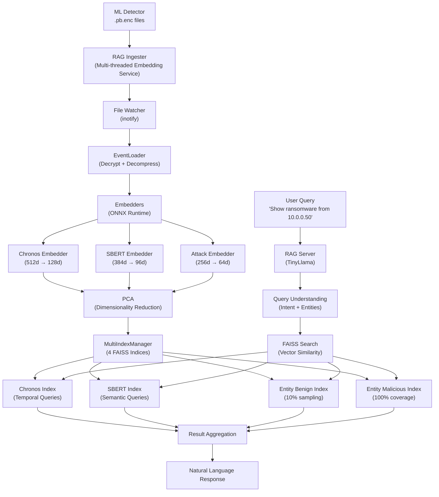

## Overview

The **RAG System** (Retrieval-Augmented Generation) provides **natural language intelligence** over ML Defender's security events. Using **TinyLlama** for language understanding and **FAISS** for vector search, it enables forensic queries like "Show me all ransomware detections from 10.0.0.50 last week" without SQL or log parsing.

<CardGroup cols={2}>
  <Card title="Components" icon="puzzle-piece">
    - **RAG Ingester**: Log parsing + vector embeddings
    - **RAG Server**: TinyLlama + FAISS query engine
    - **4 FAISS Indices**: Temporal, semantic, benign, malicious
    - **etcd Integration**: Service discovery
  </Card>
  <Card title="Capabilities" icon="sparkles">
    - **Natural Language Queries**: Ask questions in English
    - **Temporal Analysis**: "Last week", "Yesterday morning"
    - **Pattern Recognition**: "Similar to this attack"
    - **ML Retraining Data**: Export feature vectors
  </Card>
</CardGroup>

---

## Architecture

The RAG System consists of **two symbiotic services** that work together:



---

## RAG Ingester

### Multi-Index Strategy

The Ingester maintains **4 specialized FAISS indices** for different query patterns:

<Tabs>
  <Tab title="Chronos Index (Temporal)">
    **Dimensions**: 128
    
    **Purpose**: Time-series queries
    
    **Optimized For:**
    - "Show me attacks from last week"
    - "What happened on Monday between 2-4 PM?"
    - "Hourly attack trends"
    
    **Embedding Model**: Chronos temporal encoder (ONNX)
    
    **PCA**: 512d → 128d reduction for efficient storage
  </Tab>
  
  <Tab title="SBERT Index (Semantic)">
    **Dimensions**: 96
    
    **Purpose**: Behavioral pattern queries
    
    **Optimized For:**
    - "Find similar attacks"
    - "Show lateral movement patterns"
    - "DDoS with >1000 packets/sec"
    
    **Embedding Model**: Sentence-BERT (ONNX)
    
    **PCA**: 384d → 96d reduction
  </Tab>
  
  <Tab title="Entity Benign Index">
    **Dimensions**: 64
    
    **Purpose**: Benign entity queries (sampling)
    
    **Optimized For:**
    - "Normal traffic from 192.168.1.0/24"
    - "Baseline behavior for comparison"
    
    **Sampling**: 10% (reduce storage for benign events)
    
    **PCA**: 256d → 64d reduction
  </Tab>
  
  <Tab title="Entity Malicious Index">
    **Dimensions**: 64
    
    **Purpose**: Malicious entity queries (full coverage)
    
    **Optimized For:**
    - "All attacks from 10.0.0.50"
    - "Ransomware IPs blocked today"
    
    **Sampling**: 100% (every malicious event indexed)
    
    **PCA**: 256d → 64d reduction
  </Tab>
</Tabs>

### Eventual Consistency

The Ingester uses **best-effort commits** for high availability:

<CodeGroup>
```cpp Eventual Consistency Logic
// MultiIndexManager commits indices independently
void MultiIndexManager::commit_all() {
    std::vector<std::future<bool>> futures;
    
    // Parallel commits (non-blocking)
    futures.push_back(std::async(std::launch::async, 
        [this] { return chronos_index_->commit(); }));
    futures.push_back(std::async(std::launch::async, 
        [this] { return sbert_index_->commit(); }));
    futures.push_back(std::async(std::launch::async, 
        [this] { return benign_index_->commit(); }));
    futures.push_back(std::async(std::launch::async, 
        [this] { return malicious_index_->commit(); }));
    
    // Track failures but don't block
    int successes = 0;
    for (auto& future : futures) {
        if (future.get()) successes++;
    }
    
    // Availability > Consistency: Better 3/4 than 0/4
    if (successes >= 2) {
        logger_->info("Commit successful: {}/4 indices", successes);
    } else {
        logger_->warn("Partial commit: {}/4 indices", successes);
    }
}
```
</CodeGroup>

<Note>
**Design Philosophy**: **Availability over Consistency**. Better to have 3/4 indices working than to block and have 0/4.
</Note>

### Configuration

<CodeGroup>
```json rag-ingester.json
{
  "service": {
    "id": "rag-ingester-default",
    "version": "0.1.0",
    "etcd": {
      "endpoints": ["127.0.0.1:2379"],
      "heartbeat_interval_sec": 10,
      "partner_detector": "ml-detector-default"
    }
  },
  
  "ingester": {
    "input": {
      "source": "file_watch",
      "directory": "/vagrant/logs/rag/synthetic/artifacts",
      "pattern": "*.pb.enc",
      "encrypted": true,
      "compressed": true,
      "delete_after_process": false
    },
    
    "threading": {
      "mode": "single",
      "embedding_workers": 1,
      "indexing_workers": 1
    },
    
    "embedders": {
      "chronos": {
        "enabled": true,
        "onnx_path": "/vagrant/rag-ingester/models/onnx/chronos.onnx",
        "input_dim": 83,
        "output_dim": 512
      },
      "sbert": {
        "enabled": true,
        "onnx_path": "/vagrant/rag-ingester/models/onnx/sbert.onnx",
        "input_dim": 83,
        "output_dim": 384
      },
      "attack": {
        "enabled": true,
        "onnx_path": "/vagrant/rag-ingester/models/onnx/attack.onnx",
        "input_dim": 83,
        "output_dim": 256,
        "benign_sample_rate": 0.1
      }
    },
    
    "pca": {
      "enabled": true,
      "chronos_model": "/vagrant/rag-ingester/models/pca/chronos_512_128.faiss",
      "sbert_model": "/vagrant/rag-ingester/models/pca/sbert_384_96.faiss",
      "attack_model": "/vagrant/rag-ingester/models/pca/attack_256_64.faiss"
    },
    
    "faiss": {
      "index_type": "Flat",
      "metric": "L2",
      "persist_path": "/shared/faiss_indexes",
      "checkpoint_interval_events": 1000
    },
    
    "health": {
      "cv_warning_threshold": 0.20,
      "cv_critical_threshold": 0.15,
      "report_to_etcd": true
    }
  }
}
```
</CodeGroup>

### Threading Modes

<Tabs>
  <Tab title="Single-threaded (Raspberry Pi)">
    ```json
    {
      "threading": {
        "mode": "single",
        "embedding_workers": 1,
        "indexing_workers": 1
      }
    }
    ```
    
    **Memory**: ~310MB
    
    **Use Case**: Resource-constrained environments
  </Tab>
  
  <Tab title="Multi-threaded (Server)">
    ```json
    {
      "threading": {
        "mode": "parallel",
        "embedding_workers": 3,
        "indexing_workers": 4
      }
    }
    ```
    
    **Memory**: ~2GB
    
    **Use Case**: 64-core servers, high-throughput ingestion
  </Tab>
</Tabs>

---

## RAG Server (TinyLlama)

### Natural Language Query Processing

The RAG Server uses **TinyLlama** (1.1B parameters) for query understanding:

<Steps>
  <Step title="Query Understanding">
    **User Query**: "Show me all ransomware detections from 10.0.0.50 last week"
    
    **TinyLlama Extracts**:
    ```json
    {
      "intent": "search",
      "attack_type": "ransomware",
      "source_ip": "10.0.0.50",
      "time_range": {
        "start": "2025-11-01T00:00:00Z",
        "end": "2025-11-08T00:00:00Z"
      },
      "index_strategy": ["entity_malicious", "chronos"]
    }
    ```
  </Step>
  
  <Step title="Vector Search">
    **FAISS Queries** (parallel):
    
    - **Entity Malicious Index**: Find all events from 10.0.0.50
    - **Chronos Index**: Filter by time range (last week)
    
    **Results**: 47 matching events
  </Step>
  
  <Step title="Result Aggregation">
    **TinyLlama Summarizes**:
    
    ```
    Found 47 ransomware detections from 10.0.0.50 last week:
    
    - Nov 1, 14:23: Initial C&C callback (15 external IPs contacted)
    - Nov 1, 14:25: SMB lateral movement (8 hosts infected)
    - Nov 1, 14:30: Encryption started (payload entropy 7.9)
    - Nov 2-7: Daily C&C check-ins (total 39 events)
    
    Blocked: Yes (added to IPSet on Nov 1, 14:23)
    Recidivism: 39 attempts after block
    ```
  </Step>
</Steps>

### Example Queries

<CodeGroup>
```text Temporal Queries
"What attacks happened yesterday?"
"Show me DDoS events from last Monday"
"Hourly attack trends for the past week"
"Traffic patterns between 2-4 AM"
```

```text Entity Queries
"All detections from 192.168.1.0/24"
"Ransomware IPs blocked today"
"Most active malicious IP this month"
"Benign traffic baseline for 10.0.0.0/8"
```

```text Pattern Queries
"Find attacks similar to this one"
"Show lateral movement patterns"
"DDoS with >1000 packets/sec"
"Unusual SMB connections"
```

```text Forensic Queries
"Why was 10.0.0.50 blocked?"
"How did the ransomware spread?"
"What happened before the DDoS?"
"Recidivism rate for blocked IPs"
```
</CodeGroup>

---

## ML Retraining Data Export

The RAG System can export feature vectors for **ML model retraining**:

<CodeGroup>
```python Export Training Data
# Query via RAG API
query = """
Export all ransomware detections from the past 30 days
with ground truth labels (blocked = positive, 
                          false_positive = negative)
"""

response = rag_client.query(query)

# Returns Parquet file with:
# - 83 features per event
# - Ground truth labels
# - Metadata (timestamp, IP, attack_type)
df = pd.read_parquet(response.export_path)

print(df.shape)  # (12847, 86)
# 83 features + ground_truth + timestamp + source_ip
```
</CodeGroup>

**Use Cases**:
- **Model drift detection**: Compare new data distribution vs training data
- **Incremental training**: Retrain RandomForest on recent attacks
- **False positive analysis**: Identify mislabeled events

---

## Deployment

### Prerequisites

<CodeGroup>
```bash Debian/Ubuntu (RAG Ingester)
sudo apt-get install -y \
    build-essential cmake \
    libzmq3-dev libprotobuf-dev \
    liblz4-dev nlohmann-json3-dev libspdlog-dev

# FAISS (compile from source)
git clone https://github.com/facebookresearch/faiss.git
cd faiss
cmake -B build -DFAISS_ENABLE_GPU=OFF .
make -C build -j$(nproc)
sudo make -C build install

# ONNX Runtime
wget https://github.com/microsoft/onnxruntime/releases/download/v1.16.0/onnxruntime-linux-x64-1.16.0.tgz
tar -xzf onnxruntime-linux-x64-1.16.0.tgz
sudo cp -r onnxruntime-linux-x64-1.16.0/lib/* /usr/local/lib/
```

```bash Python (RAG Server)
pip install transformers torch faiss-cpu \
    sentence-transformers fastapi uvicorn
```
</CodeGroup>

### Build RAG Ingester

<Steps>
  <Step title="Navigate">
    ```bash
    cd /vagrant/rag-ingester
    mkdir -p build && cd build
    ```
  </Step>
  
  <Step title="Configure">
    ```bash
    cmake .. -DCMAKE_BUILD_TYPE=Release
    ```
  </Step>
  
  <Step title="Compile">
    ```bash
    make -j$(nproc)
    ```
  </Step>
</Steps>

### Run RAG Ingester

<CodeGroup>
```bash Standalone Mode
./rag-ingester /vagrant/rag-ingester/config/rag-ingester.json
```

```bash With Logging
./rag-ingester /vagrant/rag-ingester/config/rag-ingester.json \
  --log-level debug
```
</CodeGroup>

**Real-time Output:**
```
[RAG-INGESTER] 🚀 Starting RAG Ingester v0.1.0
[RAG-INGESTER] 📁 Watching directory: /vagrant/logs/rag/synthetic/artifacts
[RAG-INGESTER] 🧠 Loaded 3 ONNX models:
  - Chronos: 83 → 512 dimensions
  - SBERT: 83 → 384 dimensions
  - Attack: 83 → 256 dimensions
[RAG-INGESTER] 📊 PCA enabled: 512→128, 384→96, 256→64
[RAG-INGESTER] 📂 Created 4 FAISS indices (Flat, L2 metric)
[RAG-INGESTER] ✅ Ready for ingestion

[INGESTION] File: ml_detector_2025-11-01_14-23-15.pb.enc
[DECRYPT] ChaCha20-Poly1305 decryption: OK
[DECOMPRESS] LZ4 decompression: OK (1024 bytes)
[PARSE] Protobuf parsed: 47 events
[EMBED] Chronos: 47 vectors (512d)
[EMBED] SBERT: 47 vectors (384d)
[EMBED] Attack: 47 vectors (256d)
[PCA] Dimensionality reduction: 512→128, 384→ 96, 256→64
[INDEX] Added to 4 FAISS indices
[COMMIT] Checkpoint: 1000 events indexed
```

### Run RAG Server

<CodeGroup>
```bash Start TinyLlama Server
cd /vagrant/rag
python rag_server.py --config config/rag_config.json
```

```bash Query via REST API
curl -X POST http://localhost:8000/query \
  -H 'Content-Type: application/json' \
  -d '{
    "query": "Show me all ransomware detections from 10.0.0.50 last week"
  }'
```
</CodeGroup>

---

## Troubleshooting

<AccordionGroup>
  <Accordion title="FAISS Index Not Found">
    ```bash
    # Verify index files exist
    ls -lh /shared/faiss_indexes/
    
    # Should see:
    # chronos_index.faiss
    # sbert_index.faiss
    # benign_index.faiss
    # malicious_index.faiss
    
    # Rebuild indices if missing
    ./rag-ingester --rebuild-indices
    ```
  </Accordion>
  
  <Accordion title="ONNX Model Loading Fails">
    ```bash
    # Verify ONNX Runtime installation
    ldconfig -p | grep onnxruntime
    
    # Check model files exist
    ls -lh /vagrant/rag-ingester/models/onnx/*.onnx
    
    # Validate ONNX models
    python -c "import onnx; onnx.checker.check_model('chronos.onnx')"
    ```
  </Accordion>
  
  <Accordion title="TinyLlama Out of Memory">
    **Symptom**: OOM error during query processing
    
    **Solution**: Use 4-bit quantization:
    
    ```python
    from transformers import AutoModelForCausalLM
    
    model = AutoModelForCausalLM.from_pretrained(
        "TinyLlama/TinyLlama-1.1B-Chat-v1.0",
        load_in_4bit=True,
        device_map="auto"
    )
    ```
    
    **Memory**: 2GB → 600MB
  </Accordion>
  
  <Accordion title="File Watcher Not Detecting Files">
    ```bash
    # Check inotify limits
    cat /proc/sys/fs/inotify/max_user_watches
    
    # Increase if needed
    echo 524288 | sudo tee /proc/sys/fs/inotify/max_user_watches
    
    # Make persistent
    echo "fs.inotify.max_user_watches=524288" | \
      sudo tee -a /etc/sysctl.conf
    sudo sysctl -p
    ```
  </Accordion>
</AccordionGroup>

---

## Roadmap

### Priority 1.1: Firewall Log Parsing

**Goal**: Ingest firewall-agent logs for ground truth linking

<Steps>
  <Step title="Detection ↔ Block Linking">
    Link ML Detector events to Firewall Agent blocks:
    
    ```
    [ML-DETECTOR] 10.0.0.50 → Ransomware (14:23:15)
          ↓ (5ms latency)
    [FIREWALL] 10.0.0.50 added to IPSet (14:23:15)
    ```
  </Step>
  
  <Step title="Cross-component Queries">
    "Show me all detections that were NOT blocked"
    
    "What's the latency between detection and blocking?"
  </Step>
</Steps>

### Priority 1.2: Temporal Queries

**Goal**: Natural language time expressions

```
"Yesterday morning" → 2025-11-07 06:00-12:00
"Last Monday" → 2025-11-03 00:00-23:59
"Past 3 hours" → now - 3h to now
```

### Priority 1.3: Aggregation & Statistics

**Goal**: Summary queries

```
"Top 10 malicious IPs this month"
"Hourly attack distribution"
"Recidivism rate (% of blocked IPs that retry)"
```

---

## Next Steps

<CardGroup cols={2}>
  <Card title="Sniffer" icon="radar" href="/components/sniffer">
    Configure network packet capture
  </Card>
  <Card title="ML Detector" icon="brain" href="/components/ml-detector">
    Set up ML inference pipeline
  </Card>
  <Card title="Firewall Agent" icon="shield" href="/components/firewall-agent">
    Deploy autonomous blocking
  </Card>
  <Card title="Model Training" icon="graduation-cap" href="/advanced/model-training">
    Retrain models with RAG-exported data
  </Card>
</CardGroup>