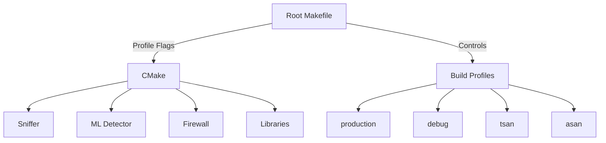
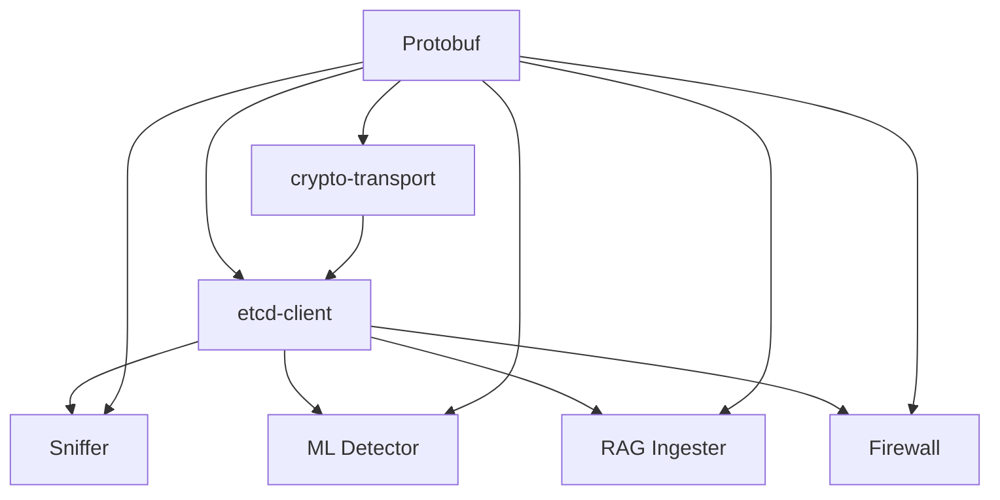

## Build System Architecture

ML Defender uses a **hierarchical build system** with a single source of truth for compiler flags and build profiles.



### Design Principles

1. **Single Source of Truth**: All compiler flags in root `Makefile` (lines 50-98)
2. **Profile-Aware Builds**: Separate build directories per profile
3. **No Flag Hardcoding**: CMakeLists.txt files receive flags from Makefile
4. **Reproducible Builds**: Same profile = same binary

---

## Build Profiles

### Profile Definitions

**From source/Makefile:50-98:**

<CodeGroup>
```makefile Production
PROFILE_PRODUCTION_CXX := -O3 -march=native -DNDEBUG -flto -fno-omit-frame-pointer
PROFILE_PRODUCTION_C   := -O3 -march=native -DNDEBUG -flto -fno-omit-frame-pointer

# Usage
make PROFILE=production all
```

```makefile Debug (Default)
PROFILE_DEBUG_CXX := -g -O0 -fno-omit-frame-pointer -DDEBUG
PROFILE_DEBUG_C   := -g -O0 -fno-omit-frame-pointer -DDEBUG

# Usage
make PROFILE=debug all
```

```makefile ThreadSanitizer
PROFILE_TSAN_CXX := -fsanitize=thread -g -O1 -fno-omit-frame-pointer -DTSAN_ENABLED
PROFILE_TSAN_C   := -fsanitize=thread -g -O1 -fno-omit-frame-pointer -DTSAN_ENABLED
PROFILE_TSAN_LD  := -fsanitize=thread

# Usage
make PROFILE=tsan all
```

```makefile AddressSanitizer
PROFILE_ASAN_CXX := -fsanitize=address -fsanitize=undefined -g -O1 -fno-omit-frame-pointer
PROFILE_ASAN_C   := -fsanitize=address -fsanitize=undefined -g -O1 -fno-omit-frame-pointer
PROFILE_ASAN_LD  := -fsanitize=address -fsanitize=undefined

# Usage
make PROFILE=asan all
```
</CodeGroup>

### Build Directory Structure

```bash
sniffer/
├── build-production/     # -O3 optimized
├── build-debug/          # -g -O0 debug symbols
├── build-tsan/           # ThreadSanitizer
├── build-asan/           # AddressSanitizer
└── build -> build-debug  # Symlink for legacy scripts
```

---

## CMake Configuration

### Correct Flag Handling

**❌ WRONG - Do not hardcode flags:**
```cmake
# CMakeLists.txt (INCORRECT)
set(CMAKE_CXX_FLAGS "-O3 -march=native")
set(CMAKE_BUILD_TYPE "Release")
```

**✅ CORRECT - Receive flags from Makefile:**
```cmake
# CMakeLists.txt (CORRECT)
# Flags come from root Makefile via CMAKE_CXX_FLAGS
message(STATUS "CXX Flags (from Makefile): ${CMAKE_CXX_FLAGS}")
```

**From source/sniffer/CMakeLists.txt:12-28:**

```cmake
# ============================================================================
# COMPILER FLAGS - CONTROLLED BY ROOT MAKEFILE
# ============================================================================
# ⚠️  NO HARDCODED FLAGS - All flags come from root Makefile via CMAKE_CXX_FLAGS
# ⚠️  DO NOT set CMAKE_BUILD_TYPE, -O flags, -march, -fsanitize here
# ⚠️  DO NOT set CMAKE_INTERPROCEDURAL_OPTIMIZATION here
#
# The root Makefile controls all optimization and sanitizer flags via:
#   make PROFILE=production  → -O3 -march=native -DNDEBUG -flto
#   make PROFILE=debug       → -g -O0 -fno-omit-frame-pointer
#   make PROFILE=tsan        → -fsanitize=thread -g -O1
#   make PROFILE=asan        → -fsanitize=address -g -O1
# ============================================================================
```

### Component CMake Flow

**From source/Makefile:277-290:**

```makefile
sniffer: proto etcd-client-build
	@echo "🔨 Building Sniffer [$(PROFILE)]..."
	@echo "   Build dir: $(SNIFFER_BUILD_DIR)"
	@echo "   Copying protobuf files..."
	@vagrant ssh -c 'mkdir -p $(SNIFFER_BUILD_DIR)/proto && \
		cp /vagrant/protobuf/network_security.pb.* $(SNIFFER_BUILD_DIR)/proto/'
	@echo "   Flags: $(CMAKE_FLAGS)"
	@vagrant ssh -c 'cd /vagrant/sniffer && \
		mkdir -p $(SNIFFER_BUILD_DIR) && \
		cd $(SNIFFER_BUILD_DIR) && \
		cmake $(CMAKE_FLAGS) .. && \
		make -j4'
```

---

## Makefile Targets Reference

### Core Build Targets

| Target | Description | Example |
|--------|-------------|----------|
| `make all` | Build all components | `make PROFILE=production all` |
| `make proto` | Regenerate Protobuf | `make proto` |
| `make sniffer` | Build eBPF sniffer | `make PROFILE=debug sniffer` |
| `make ml-detector` | Build ML detector | `make PROFILE=tsan ml-detector` |
| `make firewall` | Build firewall agent | `make firewall` |
| `make etcd-server` | Build etcd server | `make etcd-server` |
| `make tools` | Build testing tools | `make tools` |

### Library Targets

```bash
# Crypto transport library (always Release)
make crypto-transport-build

# etcd client library (always Release)
make etcd-client-build

# Clean libraries
make crypto-transport-clean
make etcd-client-clean
```

**Note**: Libraries are **always built in Release mode** (no sanitizers) to avoid linking issues.

### Clean Targets

```bash
# Clean current profile
make PROFILE=debug clean

# Clean ALL profiles (production/debug/tsan/asan)
make clean-all

# Full distclean (including protobuf artifacts)
make distclean
```

---

## Debian Packaging

### Package Build

**From source/debian/control:**

```bash
# Build Debian package
make -f Makefile.debian package

# Output:
sniffer-ebpf_0.83.0-1_amd64.deb
```

### Package Structure

```
sniffer-ebpf_0.83.0-1_amd64.deb
├── /usr/bin/sniffer_ebpf          # Binary
├── /usr/lib/bpf/sniffer.bpf.o    # eBPF object
├── /etc/sniffer-ebpf/config.json # Configuration
├── /lib/systemd/system/sniffer-ebpf.service
└── /usr/share/doc/sniffer-ebpf/  # Documentation
```

### Debian Control File

**From source/debian/control:**

```debian
Package: sniffer-ebpf
Architecture: amd64
Depends: ${shlibs:Depends}, ${misc:Depends},
         libbpf1 (>= 1:1.0),
         libprotobuf-c1 (>= 1.4),
         liblz4-1 (>= 1.9),
         libzmq5 (>= 4.3)
Description: eBPF-based network packet sniffer with ML features
 High-performance packet sniffer using eBPF/XDP technology that
 captures 83 network features per packet for machine learning analysis.
```

### Installation

```bash
# Install package
sudo dpkg -i sniffer-ebpf_0.83.0-1_amd64.deb

# Check status
sudo systemctl status sniffer-ebpf

# View logs
sudo journalctl -u sniffer-ebpf -f
```

---

## Docker Builds

### Multi-Service Architecture

**From source/ directory:**

```bash
# Service 1: Sniffer
docker build -f Dockerfile.service1 -t ml-defender/sniffer .

# Service 2: ML Detector
docker build -f Dockerfile.service2 -t ml-defender/detector .

# Service 3: Firewall
docker build -f Dockerfile.service3 -t ml-defender/firewall .
```

### Docker Compose

```yaml docker-compose.yaml
version: '3.8'

services:
  sniffer:
    build:
      context: .
      dockerfile: Dockerfile.service1
    privileged: true  # Required for eBPF
    network_mode: host
    volumes:
      - ./logs:/vagrant/logs

  ml-detector:
    build:
      context: .
      dockerfile: Dockerfile.service2
    depends_on:
      - sniffer
    volumes:
      - ./ml-detector/models:/app/models

  firewall:
    build:
      context: .
      dockerfile: Dockerfile.service3
    privileged: true  # Required for iptables
    depends_on:
      - ml-detector
```

### Running

```bash
# Start all services
docker-compose up -d

# View logs
docker-compose logs -f sniffer

# Stop
docker-compose down
```

---

## Build Dependencies

### Dependency Graph



### Build Order

**Critical**: Dependencies must be built in this order:

1. **Protobuf**: `make proto`
2. **crypto-transport**: `make crypto-transport-build`
3. **etcd-client**: `make etcd-client-build`
4. **Components**: `make sniffer ml-detector firewall`

**Automated**:
```bash
make all  # Handles dependency order automatically
```

### Verifying Dependencies

```bash
# Check library linkage
make verify-etcd-linkage

# Check encryption config
make verify-encryption

# Full pipeline validation
make verify-pipeline-config
```

---

## Cross-Compilation

### ARM64 Build (for Raspberry Pi)

```bash
# Install cross-compiler
sudo apt-get install gcc-aarch64-linux-gnu g++-aarch64-linux-gnu

# Set CMake toolchain
export CMAKE_TOOLCHAIN_FILE=cmake/aarch64-toolchain.cmake

# Build
make PROFILE=production all
```

**Toolchain file** (cmake/aarch64-toolchain.cmake):
```cmake
set(CMAKE_SYSTEM_NAME Linux)
set(CMAKE_SYSTEM_PROCESSOR aarch64)

set(CMAKE_C_COMPILER aarch64-linux-gnu-gcc)
set(CMAKE_CXX_COMPILER aarch64-linux-gnu-g++)

set(CMAKE_FIND_ROOT_PATH /usr/aarch64-linux-gnu)
set(CMAKE_FIND_ROOT_PATH_MODE_PROGRAM NEVER)
set(CMAKE_FIND_ROOT_PATH_MODE_LIBRARY ONLY)
set(CMAKE_FIND_ROOT_PATH_MODE_INCLUDE ONLY)
```

---

## Optimization Flags

### Production Build Flags

**From source/Makefile:60-61:**

```makefile
PROFILE_PRODUCTION_CXX := -O3 -march=native -DNDEBUG -flto -fno-omit-frame-pointer
PROFILE_PRODUCTION_C   := -O3 -march=native -DNDEBUG -flto -fno-omit-frame-pointer
```

| Flag | Purpose |
|------|----------|
| `-O3` | Maximum optimization |
| `-march=native` | CPU-specific optimizations |
| `-DNDEBUG` | Disable assertions |
| `-flto` | Link-time optimization |
| `-fno-omit-frame-pointer` | Better stack traces (small perf cost) |

### Performance Impact

```bash
# Benchmark build profiles
hyperfine \
  --warmup 3 \
  './build-debug/sniffer' \
  './build-production/sniffer'

# Expected results:
# debug:       ~150 MB/s throughput
# production:  ~450 MB/s throughput (3x faster)
```

---

## TSAN/ASAN Builds

### ThreadSanitizer

**From source/Makefile:465-529:**

```bash
# Full TSAN validation suite
make tsan-all

# Quick TSAN check
make tsan-quick

# View TSAN report
make tsan-summary
```

**TSAN flags** (source/Makefile:66-68):
```makefile
PROFILE_TSAN_CXX := -fsanitize=thread -g -O1 -fno-omit-frame-pointer -DTSAN_ENABLED
PROFILE_TSAN_LD  := -fsanitize=thread
```

**Environment**:
```bash
TSAN_OPTIONS="history_size=7 second_deadlock_stack=1" ./sniffer
```

### AddressSanitizer

```bash
# Build with ASAN
make PROFILE=asan sniffer

# Run
export ASAN_OPTIONS="detect_leaks=1:check_initialization_order=1"
./sniffer/build-asan/sniffer -c config.json
```

---

## Troubleshooting

### Build Fails with Undefined References

**Symptom**: `undefined reference to 'bpf_ringbuf_reserve'`

**Solution**:
```bash
# Check libbpf version
pkg-config --modversion libbpf  # Need 1.2.0+

# Rebuild with correct libbpf
make clean-all
make PROFILE=debug sniffer
```

### Protobuf Mismatch

**Symptom**: `protobuf version mismatch`

**Solution**:
```bash
make proto-verify
make proto  # Regenerate
make rebuild
```

### Stale Build Cache

```bash
# Nuclear option - clean everything
make distclean
find . -name CMakeCache.txt -delete
find . -name build-* -type d -exec rm -rf {} +

# Rebuild
make PROFILE=production all
```

---

## Next Steps

<CardGroup cols={2}>
  <Card title="Testing" icon="flask" href="/dev/testing">
    Run tests and validate builds
  </Card>
  <Card title="eBPF/XDP" icon="network-wired" href="/advanced/ebpf-xdp">
    Understand eBPF program compilation
  </Card>
  <Card title="Deployment" icon="rocket" href="/deployment/production">
    Deploy production builds
  </Card>
  <Card title="Performance" icon="gauge-high" href="/operations/performance">
    Optimize and benchmark
  </Card>
</CardGroup>