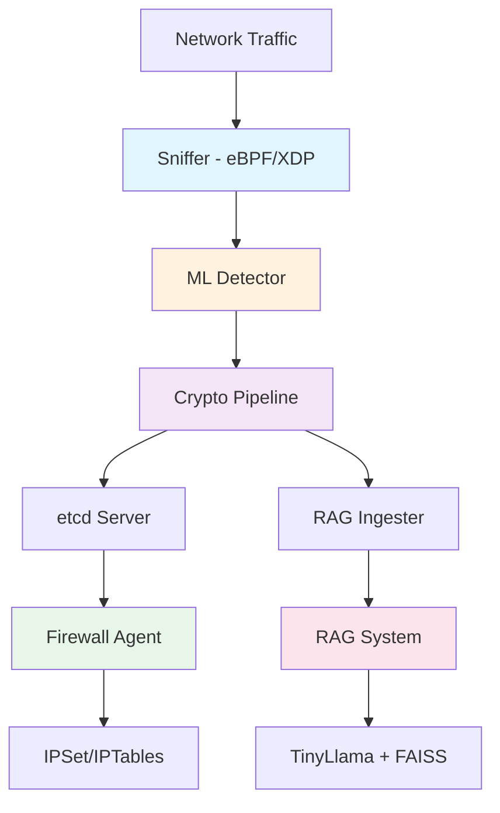

## Mission

Democratize enterprise-grade cybersecurity for hospitals, schools, and small organizations that cannot afford commercial solutions. Built to last decades with scientific honesty and methodical development.

**Philosophy**: *Via Appia Quality* – Systems built like Roman roads, designed to endure.

## Key Features

<CardGroup cols={2}>
  <Card
    title="eBPF/XDP Packet Capture"
    icon="network-wired"
  >
    High-performance kernel-space packet filtering with 512-byte payload capture. Zero-copy design with ring buffer delivery to userspace. Captures 2M+ packets over 17 hours with zero crashes.
  </Card>
  
  <Card
    title="Multi-Layer ML Detection"
    icon="brain"
  >
    4 embedded RandomForest models with 97.6% accuracy on real malware (CTU-13 Neris botnet). Sub-microsecond detection latency with 83-feature extraction pipeline.
  </Card>
  
  <Card
    title="Autonomous Blocking"
    icon="shield-halved"
  >
    Kernel-level blocking via IPSet/IPTables with sub-10ms response time. Tested at 364 events/sec with graceful degradation. Config-driven architecture with zero hardcoding.
  </Card>
  
  <Card
    title="Encrypted Pipeline"
    icon="lock"
  >
    ChaCha20-Poly1305 authenticated encryption with LZ4 compression. Production-validated with 36,000 events and zero crypto errors.
  </Card>
  
  <Card
    title="RAG Intelligence"
    icon="message-bot"
  >
    Natural language forensic queries powered by TinyLlama and FAISS vector search. Multi-index strategy with eventual consistency for high availability.
  </Card>
  
  <Card
    title="Distributed Coordination"
    icon="server"
  >
    etcd-based service discovery with automatic crypto seed exchange. Service registration, heartbeats, and distributed configuration management.
  </Card>
</CardGroup>

## Production Metrics

<Note>
  These are **real** metrics from validation testing, not marketing claims.
</Note>

### Detection Accuracy
- **97.6%** accuracy on CTU-13 Neris botnet (real ransomware)
- **36,000** events tested with zero crypto errors
- **17 hours** continuous operation (61,343 seconds)
- **2,080,549** packets processed successfully

### Performance
- **364 events/sec** peak throughput under stress
- **&lt;1 μs** normal traffic latency
- **54% CPU** maximum under extreme load (20K events)
- **127 MB RAM** memory footprint under stress
- **0 crashes** during validation period

### Reliability
- **0 crypto errors** @ 36K events
- **0 decompression errors** @ 36K events  
- **0 protobuf parse errors** @ 36K events
- **Graceful degradation** when capacity exceeded

## System Architecture

### Data Flow

1. **Network Traffic** → eBPF/XDP captures packets in kernel space
2. **Sniffer** → Extracts 512-byte payloads + 83 ML features
3. **ML Detector** → 4 RandomForest models classify threats
4. **Crypto Pipeline** → ChaCha20-Poly1305 encryption + LZ4 compression
5. **etcd Server** → Coordinates services, manages crypto keys
6. **Firewall Agent** → Autonomous blocking via IPSet/IPTables
7. **RAG Ingester** → Parses logs, generates embeddings
8. **RAG System** → Natural language queries over threat data

## Quick Links

<CardGroup cols={3}>
  <Card
    title="Quickstart"
    icon="rocket"
    href="/quickstart"
  >
    Get ML Defender running in 15 minutes
  </Card>
  
  <Card
    title="Architecture"
    icon="diagram-project"
    href="/architecture"
  >
    Deep dive into system components and data flow
  </Card>
  
  <Card
    title="Philosophy"
    icon="book-open"
    href="/philosophy"
  >
    Via Appia Quality and design principles
  </Card>
</CardGroup>

## Deployment Modes

### Host-Based IDS
Captures packets destined **to** the defender host itself. Traditional intrusion detection system mode.

- **Interface**: eth1 (WAN-facing)
- **XDP ifindex**: 3
- **Use case**: Server protection, endpoint security

### Gateway Mode
Captures packets flowing **through** the defender as a network gateway. Dual-NIC deployment for network-wide protection.

- **Interface**: eth3 (LAN-facing)
- **XDP ifindex**: 5  
- **Use case**: Network gateway, firewall appliance
- **Topology**: Client → Gateway (ML Defender) → Internet

<Warning>
  Gateway mode requires dual-NIC configuration and IP forwarding enabled.
</Warning>

## Threat Coverage

### Protected Against

<AccordionGroup>
  <Accordion title="DDoS Attacks" icon="wave-pulse">
    Volumetric, protocol, and application-layer DDoS detection using behavioral analysis. Detection based on:
    - External IP velocity (>10 new IPs in 10s)
    - Port scanning patterns (>15 unique ports)
    - RST ratio analysis (>30% aggressive connections)
    - Packet rate anomalies
  </Accordion>
  
  <Accordion title="Ransomware" icon="virus">
    Three-layer ransomware detection system:
    - **Layer 0**: 512-byte payload capture in eBPF
    - **Layer 1.5**: Shannon entropy analysis (>7.0 bits = encrypted)
    - **Layer 1**: Fast heuristics (10s window for C&C, SMB lateral movement)
    - **Layer 2**: 20 ransomware features (30s aggregation)
    
    Validated on CTU-13 Neris botnet with 97.6% accuracy.
  </Accordion>
  
  <Accordion title="Port Scanning" icon="radar">
    Detection of reconnaissance activities via:
    - Unique port tracking per source IP
    - Connection attempt velocity
    - SYN flood patterns
  </Accordion>
  
  <Accordion title="Malicious IPs" icon="ban">
    Autonomous blocking with temporal rules:
    - IPSet kernel-level enforcement
    - Configurable expiration (default: 1 hour)
    - Whitelist/blacklist support
    - Rate limiting per IP
  </Accordion>
</AccordionGroup>

### Known Limitations

<Note>
  Scientific honesty: We document what we **don't** protect against.
</Note>

- **Zero-day exploits**: No signature-based detection
- **Encrypted malware payloads**: TLS/SSL content is opaque
- **Insider threats**: No authentication/authorization layer
- **Physical attacks**: Out of scope
- **IPSet capacity**: Maximum ~500K IPs (requires multi-tier storage)

## Technology Stack

### Core Technologies
- **C++20**: Modern C++ for performance-critical components
- **eBPF/XDP**: Kernel-space packet capture
- **RandomForest**: 4 embedded ML models (97.6% accuracy)
- **ZeroMQ**: Inter-process communication (PUB/SUB pattern)
- **Protobuf**: Message serialization

### Security
- **ChaCha20-Poly1305**: AEAD encryption for threat data
- **LZ4**: Fast compression (zero errors @ 36K events)
- **IPSet/IPTables**: Kernel-level packet filtering
- **libsodium**: Crypto primitives

### Distributed Systems
- **etcd**: Service discovery, configuration management
- **etcd v3 API**: Key-value store with watch support

### AI/ML
- **TinyLlama**: Lightweight language model for queries
- **FAISS**: Vector similarity search
- **ONNX Runtime**: Neural network inference

## Validation & Testing

### Datasets
- **CTU-13 Neris Botnet**: Real ransomware behavior (97.6% accuracy)
- **Synthetic Traffic**: Custom DDoS pattern generator
- **MAWI Dataset**: Real network captures for gateway mode
- **17-hour stress test**: 2.08M packets, zero crashes

### Test Coverage
- **Unit tests**: Core algorithms and data structures
- **Integration tests**: End-to-end pipeline validation  
- **Stress tests**: 36K events across 4 progressive load tests
- **Chaos tests**: Component failure scenarios

<Tip>
  All test results are documented with actual metrics, not aspirational goals.
</Tip>

## Community & Support

### Contributing

ML Defender welcomes contributions! We practice transparent AI collaboration.

**Guidelines**:
1. Scientific honesty - Report real results, acknowledge limitations
2. AI transparency - Credit AI assistants used in development
3. Testing required - All changes must include tests
4. Documentation - Update docs with code changes
5. Via Appia Quality - Build for decades, not quarters

### AI Co-Authors

This project practices "Consejo de Sabios" (Council of Wise Ones):
- **Claude** (Anthropic) - Architecture design, code review, documentation
- **DeepSeek** - Algorithm optimization, debugging
- **Grok** (xAI) - Performance analysis, XDP expertise
- **ChatGPT** (OpenAI) - Research assistance
- **Qwen** (Alibaba) - Documentation review, routing verification

All AI contributions are explicitly credited in code comments and commit messages.

### License

MIT License - See [LICENSE](https://github.com/ml-defender/aegisIDS/blob/main/LICENSE.txt) for details.

## Next Steps

<Steps>
  <Step title="Get Started">
    Follow the [Quickstart Guide](/quickstart) to deploy ML Defender in 15 minutes.
  </Step>
  
  <Step title="Learn the Architecture">
    Read the [Architecture Guide](/architecture) to understand system components and data flow.
  </Step>
  
  <Step title="Understand the Philosophy">
    Explore [Via Appia Quality](/philosophy) and our design principles.
  </Step>
  
  <Step title="Deploy to Production">
    Review component documentation and deployment guides in the [Components](/components) section.
  </Step>
</Steps>

---

**Via Appia Quality** 🏛️ - Built to last decades

*"The road to security is long, but we build it to endure."*
